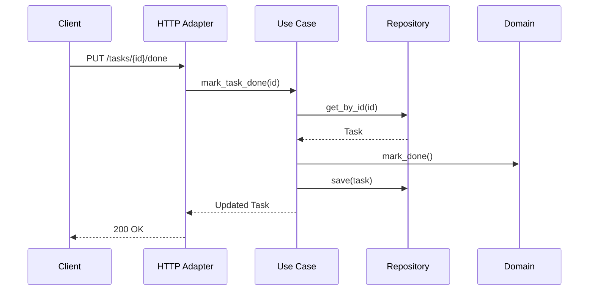

# Task Manager – Hexagonal Architecture

This service allows you to create and list tasks using a hexagonal architecture (ports and adapters). Business logic is decoupled from infrastructure details, such as the web framework or storage.

## 📋 Endpoints disponibles

### ➕ Create a task

Create a new task with a title.

```bash
curl -X POST http://localhost:5000/tasks \
  -H "Content-Type: application/json" \
  -d '{"title": "Aprender arquitectura hexagonal"}'
```

### 📄 List all tasks

Returns a list of all created tasks.

```bash
curl http://localhost:5000/tasks
```

### ✅ Mark task as done

Marks a specific task as completed.

```bash
curl -X PUT http://localhost:5000/tasks/<task_id>/done
```

## 🔄 Flow Diagram



## 🏗️ Architecture

The system follows the hexagonal architecture pattern:

1. **Domain Layer**: Contains the core business logic and entities
2. **Application Layer**: Implements use cases using the domain entities
3. **Adapters Layer**: 
   - Primary (HTTP): Handles HTTP requests
   - Secondary (Repository): Manages data persistence