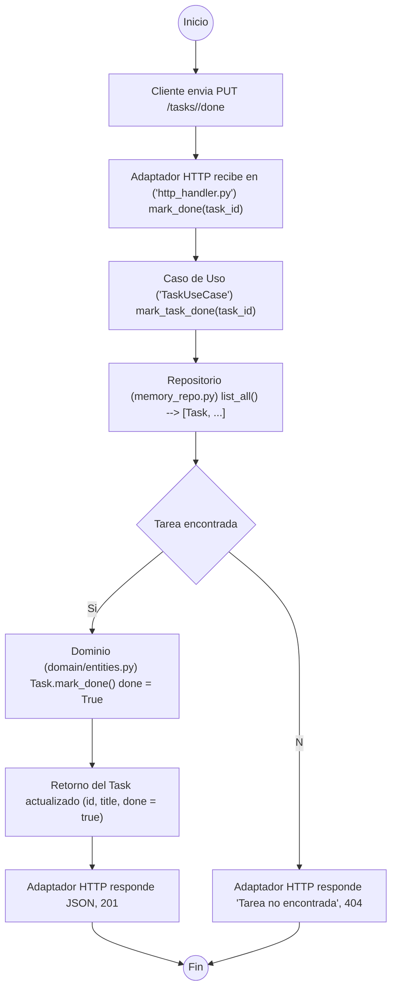

# **🧩 Sistema de Tareas - Arquitectura Hexagonal**

Este proyecto implementa un sistema de tareas simple utilizando **arquitectura hexagonal (puertos y adaptadores)** en Python con Flask.

---

## 🎯 Objetivo

Extender el sistema base para permitir que una tarea pueda ser marcada como completada (`done = true`) usando un nuevo endpoint HTTP.

Basado en el ejemplo original:  
[Hexagonal Task System - SwEng2](https://github.com/SwEng2-2025i/SwEng2_2025i_Examples/tree/main/Example%204%20-%20Hexagonal%20Architecture)

---

## 📂 Estructura del Proyecto
```
Castores/
├── main.py # Punto de entrada (Flask app)
├── domain/
│ ├── entities.py # Entidad Task
│ └── ports.py # Puertos de entrada/salida
├── application/
│ └── use_cases.py # Lógica de negocio
└── adapters/
├── http_handler.py # Endpoints HTTP (Flask)
└── memory_repo.py # Repositorio en memoria
```
---

## ✅ Funcionalidades

### ✔ Crear tarea

```http
POST /tasks
```
### Cuerpo JSON
```
{ "title": "Mi tarea" }
```
### ✔ Listar tareas
```
GET /tasks
```
Devuelve:
```
[
  {
    "id": "uuid",
    "title": "Mi tarea",
    "done": false
  }
]
```
---
## 🆕 Marcar tarea como completada

```
PUT /tasks/<id>/done
```
Marca una tarea como hecha (`done: true`)

---
## 🔁 Flujo del sistema (nuevo endpoint)



---


---
## 🧪 Pruebas con curl

Crear tarea
```
curl -X POST http://localhost:5000/tasks \
     -H "Content-Type: application/json" \
     -d "{\"title\": \"Terminar actividad\"}"
```

Marcar como hecha (reemplaza <id>)
```
curl -X PUT http://localhost:5000/tasks/<id>/done
```

Verificar en la lista
```
curl -X GET http://localhost:5000/tasks
```
---
## 🏁 Criterios de éxito

* El nuevo endpoint `PUT /tasks/<id>/done` funciona correctamente.

* Las tareas marcadas como hechas aparecen con `"done": true.`

* La lógica de negocio está aislada del adaptador HTTP (arquitectura hexagonal mantenida).

* El código está documentado y estructurado de forma clara.
