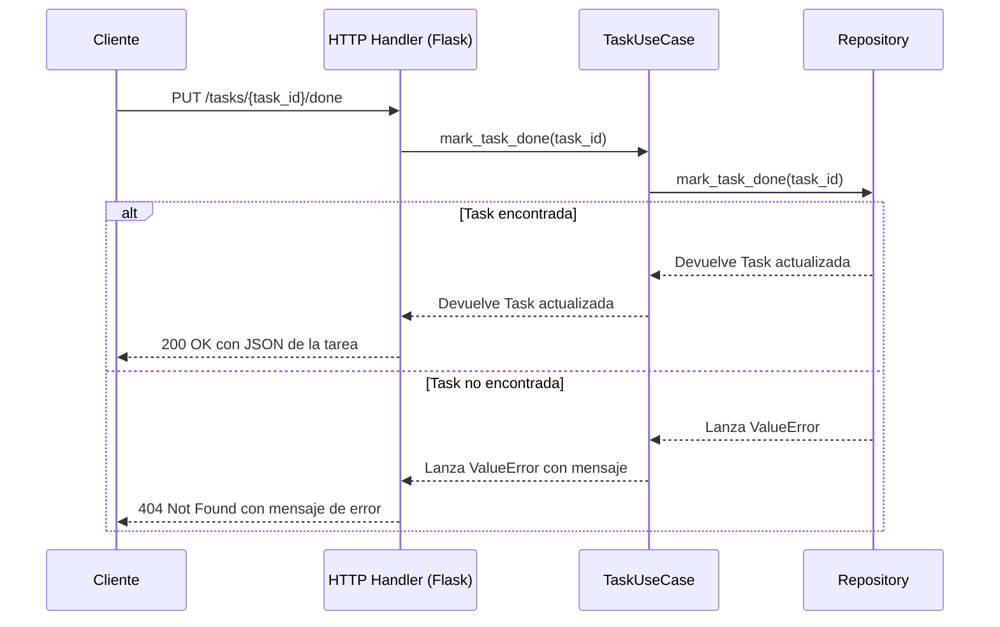

# Task Manager – Hexagonal Architecture

This service allows you to create and list tasks using a hexagonal architecture (ports and adapters). Business logic is decoupled from infrastructure details, such as the web framework or storage.

## 📋 Available Endpoints

| Method | Path                    | Description                          |
| ------ | ----------------------- | ------------------------------------ |
| POST   | `/tasks`                | Create a new task with a title.      |
| GET    | `/tasks`                | Returns a list of all created tasks. |
| PUT    | `/tasks/<task_id>/done` | Marks an existing task as completed. |

### ➕ Create a task

Create a new task with a title.

```bash
curl -X POST http://localhost:5000/tasks \
  -H "Content-Type: application/json" \
  -d '{"title": "Aprender arquitectura hexagonal"}'
```

### 📄 List all tasks

Returns a list of all created tasks.

```bash
curl http://localhost:5000/tasks
```

### ✅ Mark a task as done

Marks an existing task as completed.

```bash
curl -X PUT http://localhost:5000/tasks/<task_id>/done
```

## 🚀 How to Run

1.  **Install dependencies:**
    Use pip to install the required packages:

    ```bash
    pip install -r requirements.txt
    ```

2.  **Run the application:**
    ```bash
    python main.py
    ```
    The application will run on `http://localhost:5000` | `http://127.0.0.1:5000`.

## 📊 Diagramas de Secuencia para Marcar una Tarea como Completada




