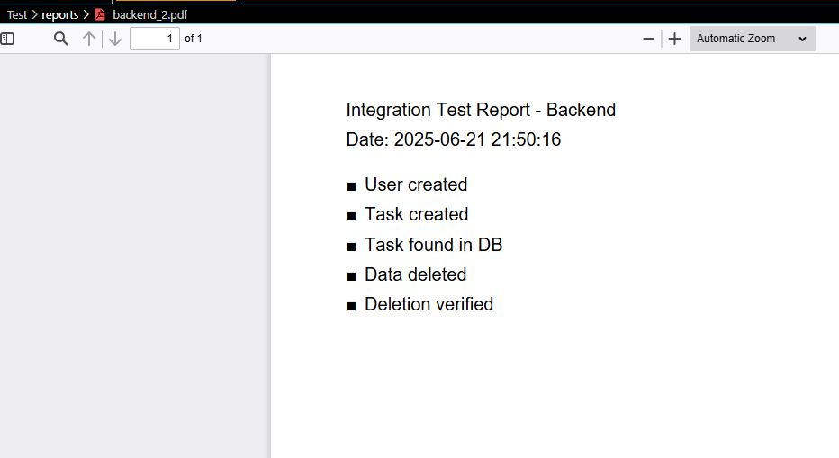
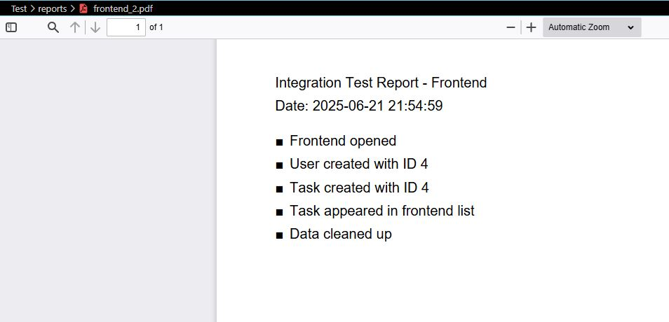

# Pruebas de Integración - Backend y Frontend

## 📌 Descripción

Este proyecto implementa pruebas de integración para un sistema básico de gestión de tareas compuesto por:
- Un **servicio de usuarios** (backend - puerto `5001`)
- Un **servicio de tareas** (backend - puerto `5002`)
- Una **interfaz frontend** (en el puerto `5000`)

Las pruebas validan el flujo completo:
1. Crear un usuario
2. Asignar una tarea al usuario
3. Confirmar que la tarea aparece en el sistema
4. Eliminar los datos creados (limpieza)
5. Verificar que la eliminación fue exitosa

Cada ejecución genera un reporte en PDF en la carpeta `reports/`.

---

## ▶️ Cómo ejecutar

### 🧪 Prueba de Integración Backend

Asegúrate de que el servicio de usuarios y el de tareas estén corriendo (`http://localhost:5001` y `http://localhost:5002`).

Ejecuta:

```bash
python BackEnd-Test.py
```
###  🧪 Prueba de Integración Frontend
Asegúrate de que todos los servicios estén corriendo, incluyendo el frontend en http://localhost:5000.

Ejecuta:
```bash
FrontEnd-Test.py
```

## 🧾 Resultados de las pruebas
Los reportes PDF se generan en la carpeta reports/:

Los archivos tienen nombre secuencial: backend_1.pdf, frontend_1.pdf, etc.

Cada PDF incluye:

 - Los pasos de la prueba

 - El resultado de cada paso (✅ o ❌)

 - La fecha y hora del test

## Ejemplo de salida:
### Reporte Backend:



### Reporte Frontend:




## 🧩 Secciones del código añadidas

### En Task_Service\main.py
```python
@service_b.route('/tasks/<int:task_id>', methods=['DELETE'])
def delete_task(task_id):
    task = Task.query.get(task_id)
    if not task:
        return jsonify({'error': 'Task not found'}), 404
    db.session.delete(task)
    db.session.commit()
    return jsonify({'message': 'Task deleted'}), 200
```

### En \Users_Service\main.py
```python
@service_a.route('/users/<int:user_id>', methods=['DELETE'])
def delete_user(user_id):
    user = User.query.get(user_id)
    if not user:
        return jsonify({'error': 'User not found'}), 404
    db.session.delete(user)
    db.session.commit()
    return jsonify({'message': 'User deleted'}), 200
```
### En Test\BackEnd-Test.py
```python
def delete_user(user_id):
    response = requests.delete(f"{USERS_URL}/{user_id}")
    response.raise_for_status()

def delete_task(task_id):
    response = requests.delete(f"{TASKS_URL}/{task_id}")
    response.raise_for_status()

def integration_test():
    resultados = []
    try:
        # Step 1: Create user
        user_id = create_user("Camilo")
        resultados.append("✅ User created")

        # Step 2: Create task
        task_id = create_task(user_id, "Prepare presentation")
        resultados.append("✅ Task created")

        # Step 3: Verify task is linked to the user
        tasks = get_tasks()
        user_tasks = [t for t in tasks if t["user_id"] == user_id]
        assert any(t["id"] == task_id for t in user_tasks), "❌ Task was not correctly registered"
        print("✅ Task successfully registered and linked to user")
        resultados.append("✅ Task found in DB")

        # Step 4: Clean up
        delete_task(task_id)
        delete_user(user_id)
        print("✅ Cleanup completed")
        resultados.append("✅ Data deleted")

        # Step 5: Verify deletion
        tasks_after = get_tasks()
        assert not any(t["id"] == task_id for t in tasks_after), "❌ Task was not deleted"
        print("✅ Verification complete: task was deleted successfully")
        resultados.append("✅ Deletion verified")
    
    except Exception as e:
        resultados.append(f"❌ ERROR: {str(e)}")

    generar_reporte_pdf(resultados, nombre="backend")

def generar_reporte_pdf(resultados, nombre="backend"):
    carpeta = "reports"
    os.makedirs(carpeta, exist_ok=True)

    existentes = [f for f in os.listdir(carpeta) if f.startswith(f"{nombre}_") and f.endswith(".pdf")]
    next_num = len(existentes) + 1
    nombre_archivo = f"{carpeta}/{nombre}_{next_num}.pdf"

    c = canvas.Canvas(nombre_archivo)
    c.setFont("Helvetica", 12)
    c.drawString(50, 800, f"Integration Test Report - {nombre.capitalize()}")
    c.drawString(50, 780, f"Date: {datetime.datetime.now().strftime('%Y-%m-%d %H:%M:%S')}")

    y = 750
    for linea in resultados:
        c.drawString(50, y, linea)
        y -= 20
        if y < 50:
            c.showPage()
            y = 800

    c.save()
    print(f"🧾 PDF report generated: {nombre_archivo}")
```

### En Test\FrontEnd-Test.py

```python
USERS_URL = "http://localhost:5001/users"
TASKS_URL = "http://localhost:5002/tasks"

def delete_user(user_id):
    response = requests.delete(f"{USERS_URL}/{user_id}")
    response.raise_for_status()

def delete_task(task_id):
    response = requests.delete(f"{TASKS_URL}/{task_id}")
    response.raise_for_status()
ef main():
    resultados = []
    # Main test runner that initializes the browser and runs the full E2E flow
    options = Options()
    # options.add_argument('--headless')  # Uncomment for headless mode
    driver = webdriver.Chrome(options=options)

    try:
        wait = WebDriverWait(driver, 10)
        abrir_frontend(driver)
        resultados.append("✅ Frontend opened")

        user_id = crear_usuario(driver, wait)
        resultados.append(f"✅ User created with ID {user_id}")

        task_id = crear_tarea(driver, wait, user_id)
        resultados.append(f"✅ Task created with ID {task_id}")

        ver_tareas(driver)
        resultados.append("✅ Task appeared in frontend list")

        time.sleep(3)  # Final delay to observe results if not running headless
        delete_task(task_id)
        delete_user(user_id)
        resultados.append("✅ Data cleaned up")
        print("✅ Data cleaned up")
    except Exception as e:
        resultados.append(f"❌ ERROR: {str(e)}")
        print(f"❌ ERROR: {str(e)}")

    finally:
        driver.quit()  # Always close the browser at the end
        generar_reporte_pdf(resultados, nombre="frontend")

def generar_reporte_pdf(resultados, nombre="frontend"):
    carpeta = "reports"
    os.makedirs(carpeta, exist_ok=True)

    existentes = [f for f in os.listdir(carpeta) if f.startswith(f"{nombre}_") and f.endswith(".pdf")]
    next_num = len(existentes) + 1
    nombre_archivo = f"{carpeta}/{nombre}_{next_num}.pdf"

    c = canvas.Canvas(nombre_archivo)
    c.setFont("Helvetica", 12)
    c.drawString(50, 800, f"Integration Test Report - {nombre.capitalize()}")
    c.drawString(50, 780, f"Date: {datetime.datetime.now().strftime('%Y-%m-%d %H:%M:%S')}")

    y = 750
    for linea in resultados:
        c.drawString(50, y, linea)
        y -= 20
        if y < 50:
            c.showPage()
            y = 800

    c.save()
    print(f"🧾 PDF report generated: {nombre_archivo}")
```
--- 

## ✅ Requisitos
Instalar dependencias necesarias:
```bash
pip install flask flask_sqlalchemy requests
pip install reportlab
pip install flask-cors
pip install selenium
```

## ✏️ Autor

**Diego Andres Alvarez Gonzalez**

1000157147