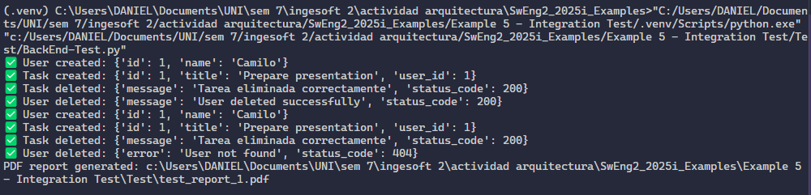
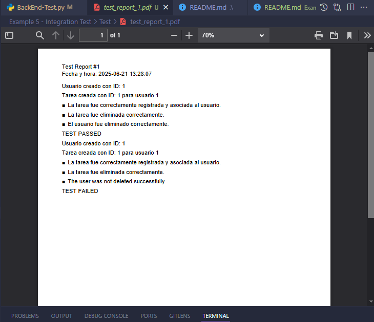
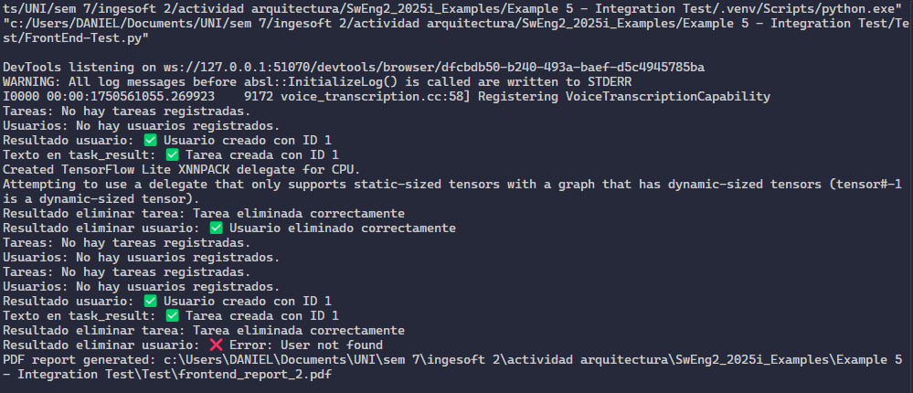
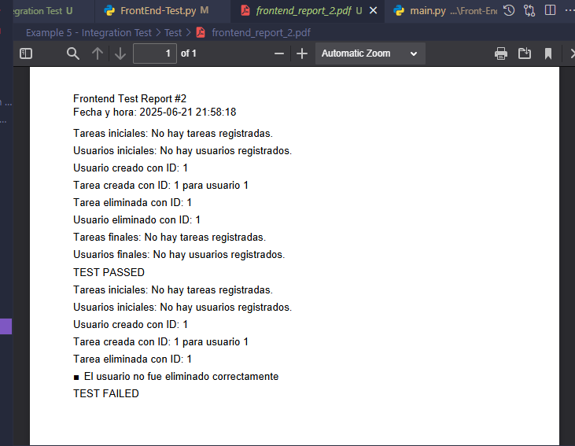

# README

---

## 📝 Test Automation & Data Cleanup

- Se implementó la limpieza automática de datos (data cleanup) en los tests: todos los datos creados por los tests (usuarios y tareas) tanto en BackEnd como en el FrontEnd se eliminan al finalizar y se verifica que realmente fueron borrados.

- Los tests de frontend y backend cuentan con dos tipos de test, el primero en el que se prueba el caso en el que si todo esta correcto, los test se muestran realizados de forma satisfactoria, tanto por consola como en los reportes de PDF.El segundo en el que se evidencia el caso de intentar eliminar un usuario de forma erronea, en donde se constat que los test mostraran en que parte se ha fallado tanto por consola como en el reporte de PDF.

---

# Secciones de código agregadas 

- Función `generar_reporte_pdf` y lógica de reporte en `Test/BackEnd-Test.py` y `Test/FrontEnd-Test.py`.
- Componentes y funciónes JS para listar usuarios, mensajes de "no hay datos", eliminar usuario y eliminar tarea en `Front-End/main.py`.
- Lógica de verificación y cleanup en los tests de `Test/BackEnd-Test.py` y `Test/FrontEnd-Test.py`

### Test/BackEnd-Test.py
```py

# Test/BackEnd-Test.py

def delete_task(task_id):
    response = requests.delete(f"{TASKS_URL}/{task_id}")
    print("✅ Task deleted:", response.json())
    return response

def delete_user(user_id):
    response = requests.delete(f"{USERS_URL}/{user_id}")
    print("✅ User deleted:", response.json())
    return response
```

### Test/FrontEnd-Test.py

```py

# Test/FrontEnd-Test.py

    def eliminar_usuario(driver, wait, user_id):
    # Elimina un usuario por ID usando el frontend
    delete_user_input = driver.find_element(By.ID, "delete-userid")
    delete_user_input.send_keys(Keys.CONTROL + "a")
    delete_user_input.send_keys(Keys.DELETE)
    delete_user_input.send_keys(user_id)
    driver.find_element(By.XPATH, "//button[contains(text(), 'Eliminar Usuario')]").click()
    time.sleep(2)
    result = driver.find_element(By.ID, "delete-user-result").text
    print("Resultado eliminar usuario:", result)
    assert "Usuario eliminado correctamente" in result, '❌ El usuario no fue eliminado correctamente'

def eliminar_tarea(driver, wait, task_id):
    # Elimina una tarea por ID usando el frontend
    delete_task_input = driver.find_element(By.ID, "delete-taskid")
    delete_task_input.send_keys(Keys.CONTROL + "a")
    delete_task_input.send_keys(Keys.DELETE)
    delete_task_input.send_keys(task_id)
    driver.find_element(By.XPATH, "//button[contains(text(), 'Eliminar Tarea')]").click()
    time.sleep(2)
    result = driver.find_element(By.ID, "delete-task-result").text
    print("Resultado eliminar tarea:", result)
    assert "Tarea eliminada correctamente" in result, '❌ La tarea no fue eliminada correctamente'
```

- Funciones de eliminar usuario y eliminar tarea en los archivos `User_Service` y `Task_Service`

```py

# Elimiar un usuario por ID

@service_a.route('/users/<int:user_id>', methods=['DELETE'])
def delete_user(user_id):
    user= User.query.get(user_id)
    if user:
        db.session.delete(user)
        db.session.commit()
        return jsonify({'message': 'User deleted successfully',
                        'status_code' : 200}), 200
    else:
        return jsonify({'error': 'User not found',
                        'status_code' : 404}), 404

```

```py

# Elimiar una tarea por ID

@service_b.route('/tasks/<int:task_id>', methods=['DELETE'])
def delete_task(task_id):
    task = Task.query.get(task_id)
    # print(task)
    if task:
        db.session.delete(task)
        db.session.commit()
        return jsonify({'message': 'Tarea eliminada correctamente', 'status_code': 200}), 200
    else:
        return jsonify({'error': 'Tarea no encontrada', 'status_code': 404}), 404
    
  
```
---

# RESULTADOS

###  Resultado de BackEnd Test por consola



### Resultado de BackEnd Test en el reporte PDF



###  Resultado de FrontEnd Test por consola



### Resultado de FrontEnd Test en el reporte PDF



