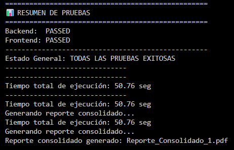

# Actividad en clase : Test de Integración - Sistema de Gestión de Usuarios y Tareas

### Gabriela Gallegos Rubio

## Descripción
Sistema distribuido compuesto por tres servicios principales: gestión de usuarios, gestión de tareas y una interfaz web frontend. Incluye suite completa de pruebas automatizadas con generación de reportes en PDF.

### Puertos
- **Users Service** (Puerto 5001): Gestión de usuarios con operaciones CRUD
- **Task Service** (Puerto 5002): Gestión de tareas vinculadas a usuarios
- **Frontend Service** (Puerto 5000): Interfaz web para interactuar con los servicios

### Características Principales
- Comunicación entre servicios mediante API REST
- Validación de integridad referencial (tareas vinculadas a usuarios existentes)
- Soporte para CORS para integración frontend-backend
- Base de datos SQLite independiente para cada servicio

## Dependencias 

### Framework Web y APIs
- **Flask**: Framework web principal para crear los servicios REST
- **Flask-SQLAlchemy**: ORM para manejo de bases de datos SQLite
- **Flask-Cors**: Habilitación de CORS para comunicación frontend-backend
- **requests**: Cliente HTTP para comunicación entre servicios

### Testing y Reportes
- **selenium**: Automatización de navegadores para pruebas end-to-end
- **reportlab**: Generación de documentos PDF con reportes de pruebas


## Instalación

1. Clonar el repositorio o descargar los archivos
2. Navegar al directorio del proyecto
3. Instalar las dependencias:

```bash
pip install -r requirements.txt
```

## Sistema de Pruebas Automatizadas

### Tipos de Pruebas
1. **Pruebas de Backend**: Verifican integración entre servicios de usuarios y tareas
2. **Pruebas de Frontend**: Automatización end-to-end usando Selenium WebDriver

### Características de las Pruebas
- Limpieza automática de datos de prueba
- Verificación de eliminación de recursos de prueba creados
- Captura completa de logs durante ejecución
- Generación automática de reportes en PDF

### Ejecución de Pruebas

#### Opción 1: Prueba Global 
```bash
cd Test
python run_all_tests.py
```
Genera: `Reporte_Consolidado_X.pdf` con resultados de ambas pruebas

#### Opción 2: Pruebas Individuales
```bash
cd Test
python BackEnd-Test.py    
python FrontEnd-Test.py  
```
Genera reportes individuales: `Reporte_Backend_X.pdf` y `Reporte_Frontend_X.pdf`

## Reportes de Pruebas

### Contenido de los Reportes
- Fecha y hora de ejecución
- Estado general de las pruebas (PASSED/FAILED)
- Logs completos de ejecución
- Detalles de errores en caso de fallos

## Estructura del repositorio
```
/
├── README.md
├── requirements.txt
├── Front-End/
│   └── main.py              
├── Users_Service/
│   └── main.py              # API de gestión de usuarios
├── Task_Service/
│   └── main.py              # API de gestión de tareas
└── Test/
    ├── BackEnd-Test.py      # Pruebas de integración backend
    ├── FrontEnd-Test.py     # Pruebas end-to-end frontend
    ├── report_generator.py  # Módulo de generación de reportes
    ├── run_all_tests.py     # Ejecutor de suite completa
    └── Reporte_Consolidado_1.pdf  #Reporte generado
└── Results/
    ├── console.png          # Resultados consola
```

### Consideraciones de la gestión de datos
- Cada servicio mantiene su propia base de datos SQLite
- Las pruebas crean y eliminan datos automáticamente
- La limpieza post-prueba garantiza no contaminar el sistema

### RESULTADOS 



En este caso ambos test tuvieron resultados exitosos, como aspecto a mejorar se podrían presentar de forma más estética la información en el documento, sin embargo cumple con la función esperada. 