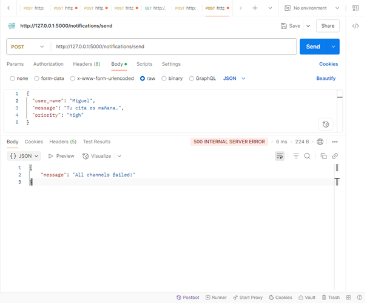

# Juan Camilo López Bustos

# Laboratory1 - Sistema de Notificaciones con Patrones de Diseño

## Descripción

Este proyecto implementa una API RESTful para un sistema de notificaciones utilizando **Python** y **Flask**, aplicando los siguientes patrones de diseño:

- **Chain of Responsibility (Cadena de Responsabilidad):** Para el manejo secuencial de envío de notificaciones por diferentes canales (email, SMS, consola).
- **Singleton:** Para la gestión centralizada de logs mediante un logger único en toda la aplicación.

El sistema permite registrar usuarios con preferencias de canal y canales disponibles, y enviarles notificaciones con fallback automático en caso de fallos.

---

## Estructura del Proyecto

```
Laboratory1/
├── app.py
├── logger.py
├── requirements.txt
├── README.md
├── channels/
│   ├── __init__.py
│   ├── base.py
│   ├── email.py
│   ├── sms.py
│   └── console.py
└── models/
    ├── __init__.py
    └── user.py
```

---

## Instalación y Ejecución

### 1. Clonar el repositorio

```sh
git clone https://github.com/SwEng2-2025i/MJ7h.git
cd MJ7h/Laboratory1
```

### 2. Crear y activar el entorno virtual

- En Windows (cmd):

  ```sh
  python -m venv venv
  venv\Scripts\activate
  ```

- En PowerShell:

  ```sh
  python -m venv venv
  venv\Scripts\Activate.ps1
  ```

### 3. Instalar dependencias

```sh
pip install -r requirements.txt
```

### 4. Ejecutar la aplicación

```sh
python app.py
```

---

## Endpoints de la API

### 1. Crear usuario

**POST** `/users`

- **Body (JSON):**
  ```json
  {
    "name": "Juan",
    "preferred_channel": "email",
    "available_channels": ["email", "sms", "console"]
  }
  ```
- **Respuesta exitosa:**  
  `201 Created`
  ```json
  {"message": "User Juan created"}
  ```

---

### 2. Listar usuarios

**GET** `/users`

- **Respuesta:**
  ```json
  [
    {
      "name": "Juan",
      "preferred_channel": "email",
      "available_channels": ["email", "sms", "console"]
    }
  ]
  ```

---

### 3. Enviar notificación

**POST** `/notifications/send`

- **Body (JSON):**
  ```json
  {
    "user_name": "Juan",
    "message": "Tu cita es mañana.",
    "priority": "high"
  }
  ```
- **Respuesta exitosa:**  
  `200 OK`
  ```json
  {"message": "Notification sent successfully"}
  ```
- **Respuesta si todos los canales fallan:**  
  `500 Internal Server Error`
  ```json
  {"message": "All channels failed!"}
  ```

---

### 4. Ver logs

**GET** `/logs`

- **Respuesta:**
  ```json
  [
    "EMAIL enviado a Juan: Tu cita es mañana.",
    "SMS falló para Juan",
    "CONSOLE mostrado para Juan: Tu cita es mañana."
  ]
  ```

---

## Ejemplo de Uso con Postman

### 1. Registrar usuario
- Método: **POST**
- URL: `http://127.0.0.1:5000/users`
  ```json
  {
    "name": "Miguel",
    "preferred_channel": "email",
    "available_channels": ["email", "sms"]
  }
  ```
respuesta :
  ```json
  {"message": "User Juan created"}
  ```


---

### 2. Listar usuarios

- Método: **GET**
- URL: `http://127.0.0.1:5000/users`
  


---

### 3. Enviar notificación

- Método: **POST**
- URL: `http://127.0.0.1:5000/notifications/send`
  ```json
  {
    "user_name": "Miguel",
    "message": "Tu cita es mañana.",
    "priority": "high"
  }
  ```
-Exito(200):


- Error(500):



---

### 4. Ver logs

- Método: **GET**
- URL: `http://127.0.0.1:5000/logs`
- Haz clic en **Send**.
- Verás el historial de logs generados por el sistema.

---

## Patrones de Diseño Implementados

### 1. Chain of Responsibility

Permite que el envío de notificaciones pase secuencialmente por los canales disponibles para el usuario. Si el canal preferido falla, la solicitud pasa al siguiente canal en la cadena, y así sucesivamente hasta que la notificación se envía correctamente o se terminan los canales.

**Ubicación:**  
- `channels/base.py`
- `channels/email.py`
- `channels/sms.py`
- `channels/console.py`
- Lógica en `app.py` (función `build_channel_chain`)

### 2. Singleton

El logger está implementado como Singleton, garantizando una única instancia de logs para toda la aplicación. Todos los canales y la API usan este logger para registrar los eventos de envío y fallos.

**Ubicación:**  
- `logger.py`

---


## Dependencias

- Python 3.8+
- Flask
- flask-swagger-ui (opcional, para documentación Swagger)

Las dependencias están listadas en `requirements.txt`.

---

## Autor

- Nombre: **[Juan Camilo Lopez BUstos]**
- Curso: Ingeniería de Software II (2025i)
- Universidad: **[Universidad Nacional de Colombia]**

---

