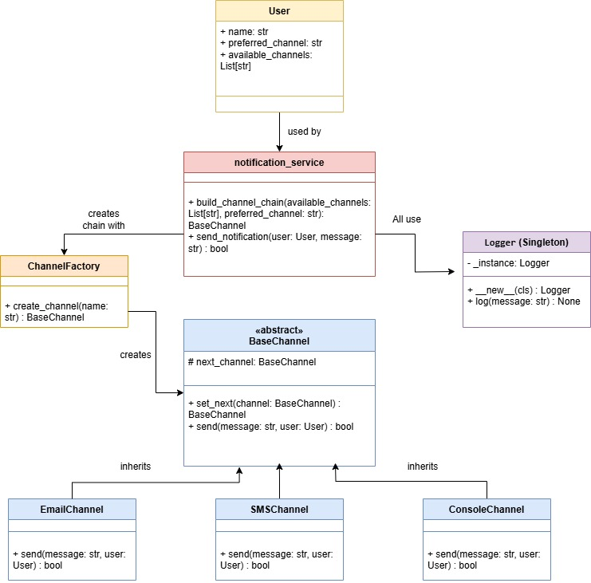

# 📬 Sistema de Notificaciones Multicanal (REST API)

## 👤 Autor
**Nombre completo:** Diego Andres Alvarez Gonzalez
---

## 📖 Descripción del Sistema

Este sistema permite registrar usuarios con múltiples canales de comunicación disponibles (email, SMS y consola). Cuando se envía una notificación, se intenta entregar primero a través del canal preferido del usuario. Si falla (simulado aleatoriamente), se intenta con los canales de respaldo, aplicando el patrón **Chain of Responsibility**.

---

## 🧩 Patrones de Diseño Usados

- **Chain of Responsibility (Cadena de Responsabilidad):** Para encadenar múltiples canales de notificación.
- **Factory Method:** Para crear dinámicamente instancias de canales (email, SMS, consola).
- **Singleton:** Para la clase `Logger`, asegurando una única instancia global para registrar eventos.

---

## 🧪 Endpoints de la API

### ➕ Registrar usuario
**POST** `/users`

**Body JSON:**
```json
{
  "name": "Diego",
  "preferred_channel": "email",
  "available_channels": ["email", "sms", "console"]
}
```
Respuesta:
```json
{
  "message": "Usuario Diego registrado"
}
```
### 📋 Listar usuarios
**GET** `/users`

Respuesta:
```json
[
  {
    "name": "Diego",
    "preferred_channel": "email",
    "available_channels": ["email", "sms", "console"]
  }
]

```

### 📤 Enviar notificación
**POST** `/notifications/send`

**Body JSON:**
```json
{
  "user_name": "Diego",
  "message": "Tu cita es mañana.",
  "priority": "alta"
}
```

Respuesta posible si todos fallan:
```json
{
  "message": "Fallaron todos los intentos de notificación"
}
```
## ⚙️ Estructura del Proyecto
```bash
1000157147/
├── app.py
├── models/
│   └── user.py
├── services/
│   └── notification_service.py
├── channels/
│   ├── base_channel.py
│   ├── email_channel.py
│   ├── sms_channel.py
│   └── console_channel.py
├── factories/
│   └── channel_factory.py
├── logger/
│   └── logger_singleton.py
└── README.md
```
## 🧾 Diagrama de Clases

## 🧠 Justificación de los Patrones

### 🔗 **Chain of Responsibility**  
✔ Permite probar canales alternativos si el preferido falla  
✔ Implementa el flujo: _preferido → alternativo 1 → alternativo 2_  
✔ Cada canal solo conoce el siguiente en la cadena  

### 🏭 **Factory Method**  
✔ Desacopla la creación de canales (`email`, `sms`, `console`)  
✔ Centraliza la lógica de instanciación en `ChannelFactory`  
✔ Facilita añadir nuevos canales sin modificar el código cliente  

### 🕹️ **Singleton (Logger)**  
✔ Garantiza una única instancia global de logger  
✔ Evita múltiples instancias dispersas de registro  
✔ Simplifica el acceso desde cualquier parte del sistema  
## 🚀 Cómo Ejecutar el Proyecto
### 1. Requisitos
- **Python**
- **Flask** (instalar con):
  ```bash
  pip install flask
  ```
 ### 2. Ejecutar servidor
Desde la raíz del proyecto:
```bash
python app.py
  ```
 ### 3. Pruebas con curl o Postman
 **Registrar usuario:**
 ```bash
curl -X POST http://127.0.0.1:5000/users -H "Content-Type: application/json" -d \
'{
  "name": "Laura",
  "preferred_channel": "email",
  "available_channels": ["email", "sms", "console"]
}'
  ```
**Enviar notificación:**
```bash
curl -X POST http://127.0.0.1:5000/notifications/send \
-H "Content-Type: application/json" \
-d '{
  "user_name": "Laura",
  "message": "Recordatorio: tu cita es mañana.",
  "priority": "alta"
}'
```
**Listar usuarios registrados:**
```bash
curl http://127.0.0.1:5000/users
```
## 📚 Documentación API con Swagger

El proyecto incluye documentación interactiva generada automáticamente con Swagger, que permite:

- Probar los endpoints directamente desde el navegador
- Ver los modelos de solicitud/respuesta
- Consultar los códigos de estado posibles

### Acceso a la documentación
Abre en tu navegador:
```bash
http://127.0.0.1:5000/apidocs/
```
### Características de la documentación
**Para usuarios:**
- Registro de nuevos usuarios
- Listado de todos los usuarios registrados
- Esquema JSON completo para el cuerpo de las peticiones

**Para notificaciones:**
- Envío de notificaciones con diferentes prioridades
- Ejemplos de respuestas exitosas y fallidas
- Códigos de error detallados (404, 500, etc.)