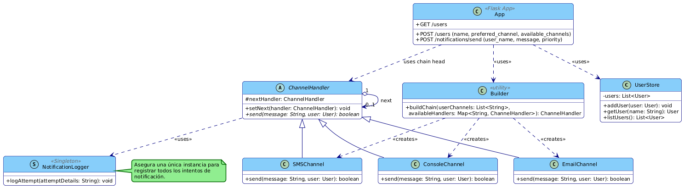

# Lab 1, Multichannel Notification System

### David Fernando Adames Rondon

---

## System Explanation

This project implements a REST API system to send multichannel notifications using the Chain of Responsibility and Singleton design patterns. Users can register with available communication channels (email, SMS, console) and set a preferred channel. Notifications are sent using the preferred channel first; if it fails, the system falls back to the next available channels.


---

## 🔗 Endpoints

### POST `/users`
Register a new user.
```json
{
  "name": "Juan",
  "preferred_channel": "email",
  "available_channels": ["email", "sms"]
}
```
**Responses**:
- `201 Created`: User successfully registered
- `400 Bad Request`: Missing data or preferred channel not in the list

---

### GET `/users`
List all users.
**Response**:
```json
{
  "users": [
    {
      "name": "Juan",
      "preferred_channel": "email",
      "available_channels": ["email", "sms"]
    }
  ]
}
```

---

### POST `/notifications/send`
Send a notification to a user
```json
{
  "user_name": "Juan",
  "message": "Your appointment is tomorrow.",
  "priority": "high"
}
```
**Response**:
```json
{
  "delivered": true,
  "attempts": [
    {"channel": "email", "success": false},
    {"channel": "sms", "success": true}
  ],
  "priority": "high"
}
```

---

## 🤸‍♂️ Design Patterns Used

### 1. Chain of Responsibility
- Each notification channel implements a `ChannelHandler`.
- A chain is built with the preferred channel at the front.
- If it fails, the next channel in the chain is called.

### 2. Singleton
- The `NotificationLogger` follows the Singleton pattern to ensure a single point of logging for attempts.

---

## 📄 Class/module diagram


---
Diagram created in plantuml with the support of gemini 2.5 pro to adapt it to the required language.

## 📅 Setup and Testing

### Requirements
- Python 3.7+
- Flask

### Installation
```bash
pip install flask
```

### Run the API
(if you are in the 1000252828 folder)
```bash
python app/app.py
```
### Test with `curl`

#### Create User
```bash
curl -X POST http://localhost:5000/users \
  -H "Content-Type: application/json" \
  -d '{"name": "Juan", "preferred_channel": "email", "available_channels": ["email", "sms"]}'
```

#### Send Notification
```bash
curl -X POST http://localhost:5000/notifications/send \
  -H "Content-Type: application/json" \
  -d '{"user_name": "Juan", "message": "Your appointment is tomorrow.", "priority": "high"}'
```

---

## 📑 Swagger Documentation
documentation is included in:
```
swagger.yaml
```

---
in the endpoint: http://127.0.0.1:5000/docs/