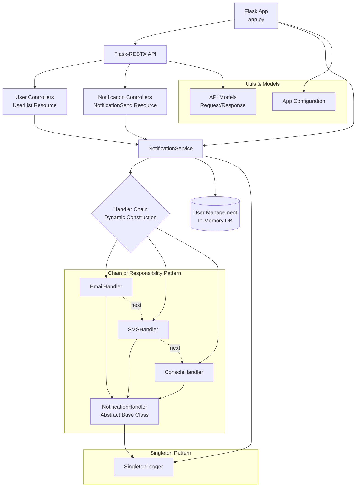

# 🧪 Multichannel Notification System - Laboratory Documentation

## 📋 Table of Contents
- [Author Information](#author-information)
- [Project Overview](#project-overview)
- [System Architecture](#system-architecture)
- [Design Patterns Implementation](#design-patterns-implementation)
- [API Documentation](#api-documentation)
- [Setup Instructions](#setup-instructions)
- [Testing Guide](#testing-guide)
- [Project Structure](#project-structure)
- [Technical Implementation Details](#technical-implementation-details)

---

## 👨‍💼 Author Information
**ID:** 1000365144
**Laboratory:** Advanced Individual Lab - Multichannel Notification System (REST API)  
**Course:** Software Engineering II  
**Submission Date:** May 30, 2025

---

## 🎯 Project Overview

This project implements a sophisticated REST API for a multichannel notification system that demonstrates advanced software engineering principles through the implementation of multiple design patterns. The system allows users to register with multiple communication channels and intelligently handles notification delivery with automatic failover capabilities.

### Key Features
- ✅ **Multi-channel Support**: Email, SMS, and Console notifications
- ✅ **Intelligent Failover**: Automatic retry with backup channels using Chain of Responsibility
- ✅ **User Management**: Registration and retrieval of users with channel preferences
- ✅ **Comprehensive Logging**: Singleton logger for centralized logging
- ✅ **REST API**: Fully documented API with Swagger UI
- ✅ **Modular Architecture**: Clean, maintainable, and extensible codebase

### Technical Stack
- **Framework**: Flask 2.2.3
- **API Documentation**: Flask-RESTX 0.5.1
- **Design Patterns**: Chain of Responsibility, Singleton
- **Data Storage**: In-memory (as per requirements)
- **Documentation**: Swagger UI

---

## 🏗️ System Architecture

### Class/Module Diagram



### System Flow

1. **User Registration**: Users register with preferred and available communication channels
2. **Notification Request**: API receives notification request with user, message, and priority
3. **Channel Selection**: System dynamically builds handler chain starting with user's preferred channel
4. **Delivery Attempt**: Chain of Responsibility pattern handles delivery with automatic failover
5. **Logging**: Singleton logger records all attempts and outcomes
6. **Response**: API returns success/failure status with detailed information

---

## 🎨 Design Patterns Implementation

### 1. Chain of Responsibility Pattern

**Purpose**: Handles notification delivery with automatic failover mechanism.

**Implementation Location**: 
- `handlers/base_handler.py` - Abstract base class defining chain interface
- `handlers/email_handler.py`, `handlers/sms_handler.py`, `handlers/console_handler.py` - Concrete implementations
- `services/notification_service.py` - Dynamic chain construction logic

**How it Works**:
```python
# Example chain construction in NotificationService
preferred = user.get("preferred_channel")  # e.g., "email"
current_handler = EmailHandler()  # Start with preferred
current_handler.set_next(SMSHandler())  # Add backup
current_handler.next.set_next(ConsoleHandler())  # Add final fallback
```

**Benefits**:
- ✅ **Decoupling**: Separates notification sender from specific channel handlers
- ✅ **Flexibility**: Easy to add new channels without modifying existing code
- ✅ **Reliability**: Automatic failover ensures message delivery
- ✅ **Configurability**: User-specific channel preferences and ordering

**Random Failure Simulation**:
```python
# In base_handler.py
def send_notification(self, user, message, priority):
    return random.choice([True, False])  # 50% success rate simulation
```

### 2. Singleton Pattern

**Purpose**: Ensures single instance of logger throughout the application for centralized logging.

**Implementation Location**: `utils/logger.py`

**How it Works**:
```python
class SingletonLogger:
    _instance = None
    
    def __new__(cls):
        if cls._instance is None:
            cls._instance = super(SingletonLogger, cls).__new__(cls)
            cls._instance._init_logger()
        return cls._instance
```

**Benefits**:
- ✅ **Centralized Logging**: Single point for all system logs
- ✅ **Resource Efficiency**: Prevents multiple logger instances
- ✅ **Consistency**: Unified logging format across application
- ✅ **Global Access**: Easy access from any part of the application

**Features**:
- Console output for real-time monitoring
- File logging (`notifications.log`) for persistence
- Structured logging with timestamps and levels

---

## 📚 API Documentation

### Base URL
```
http://127.0.0.1:5000/
```

### Swagger Documentation
Interactive API documentation available at: `http://127.0.0.1:5000/swagger/`

### Endpoints Overview

| Method | Endpoint | Description | Request Body |
|--------|----------|-------------|--------------|
| `POST` | `/users` | Register a new user | UserModel |
| `GET` | `/users` | List all registered users | None |
| `POST` | `/notifications/send` | Send notification to user | NotificationModel |

### Detailed Endpoint Documentation

#### 1. Register User
**Endpoint**: `POST /users`  
**Description**: Registers a new user with channel preferences.

**Request Model**:
```json
{
  "name": "string (required)",
  "preferred_channel": "string (required) - one of: email, sms, console",
  "available_channels": ["array of strings (required) - channels user can receive"]
}
```

**Example Request**:
```json
{
  "name": "Alice Johnson",
  "preferred_channel": "email",
  "available_channels": ["email", "sms", "console"]
}
```

**Response**:
- **201 Created**: User successfully registered
- **400 Bad Request**: User already exists or invalid data

#### 2. List Users
**Endpoint**: `GET /users`  
**Description**: Retrieves all registered users.

**Response Example**:
```json
[
  {
    "name": "Alice Johnson",
    "preferred_channel": "email",
    "available_channels": ["email", "sms", "console"]
  },
  {
    "name": "Bob Smith",
    "preferred_channel": "sms",
    "available_channels": ["sms", "console"]
  }
]
```

#### 3. Send Notification
**Endpoint**: `POST /notifications/send`  
**Description**: Sends notification to specified user with automatic channel failover.

**Request Model**:
```json
{
  "user_name": "string (required)",
  "message": "string (required)",
  "priority": "string (required) - high, medium, or low"
}
```

**Example Request**:
```json
{
  "user_name": "Alice Johnson",
  "message": "Your package has been delivered!",
  "priority": "high"
}
```

**Response**:
- **200 OK**: Notification processed successfully
- **400 Bad Request**: User not found or delivery failed

---

## ⚙️ Setup Instructions

### Prerequisites
- **Python**: 3.7 or higher
- **pip**: Python package installer
- **Operating System**: Windows, macOS, or Linux

### Step-by-Step Setup

#### 1. Environment Preparation
```bash
# Navigate to project directory
cd /home/juruizra/Documents/IngeSoft/MJ7h/laboratories/laboratory_1/100036144

# Create virtual environment (recommended)
python -m venv venv

# Activate virtual environment
# On Linux/macOS:
source venv/bin/activate
# On Windows:
# venv\Scripts\activate
```

#### 2. Install Dependencies
```bash
# Install required packages
pip install -r requirements.txt
```

**Dependencies installed**:
- `Flask==2.2.3` - Web framework
- `Flask-RESTX==0.5.1` - REST API and Swagger documentation

#### 3. Run the Application
```bash
# Start the Flask development server
python app.py
```

**Expected Output**:
```
 * Running on http://127.0.0.1:5000
 * Debug mode: on
 * Restarting with stat
 * Debugger is active!
```

#### 4. Verify Installation
- **API Base**: http://127.0.0.1:5000/
- **Swagger UI**: http://127.0.0.1:5000/swagger/
- **Health Check**: Access any endpoint to verify functionality

### Configuration Options

#### Logging Configuration
- **Console Logs**: Real-time output during development
- **File Logs**: Persistent logging in `notifications.log`
- **Log Levels**: INFO, DEBUG, WARNING, ERROR, CRITICAL

#### Development vs Production
```python
# In app.py - modify for production
if __name__ == '__main__':
    app.run(debug=False, host='0.0.0.0', port=5000)  # Production settings
```

---

## 🧪 Testing Guide

### Testing Strategy
This section provides comprehensive testing instructions using multiple approaches: cURL commands, Postman examples, and Swagger UI testing.

### 1. cURL Testing Examples

#### Test 1: Register Multiple Users
```bash
# Register first user - Alice (prefers email)
curl -X POST http://127.0.0.1:5000/users \
  -H "Content-Type: application/json" \
  -d '{
    "name": "Alice Johnson",
    "preferred_channel": "email",
    "available_channels": ["email", "sms", "console"]
  }'

# Register second user - Bob (prefers SMS)
curl -X POST http://127.0.0.1:5000/users \
  -H "Content-Type: application/json" \
  -d '{
    "name": "Bob Smith",
    "preferred_channel": "sms",
    "available_channels": ["sms", "console"]
  }'

# Register third user - Carol (console only)
curl -X POST http://127.0.0.1:5000/users \
  -H "Content-Type: application/json" \
  -d '{
    "name": "Carol Williams",
    "preferred_channel": "console",
    "available_channels": ["console"]
  }'
```

#### Test 2: List All Users
```bash
# Retrieve all registered users
curl -X GET http://127.0.0.1:5000/users \
  -H "Accept: application/json"
```

#### Test 3: Send Various Notifications
```bash
# High priority notification to Alice
curl -X POST http://127.0.0.1:5000/notifications/send \
  -H "Content-Type: application/json" \
  -d '{
    "user_name": "Alice Johnson",
    "message": "URGENT: Security alert on your account!",
    "priority": "high"
  }'

# Medium priority notification to Bob
curl -X POST http://127.0.0.1:5000/notifications/send \
  -H "Content-Type: application/json" \
  -d '{
    "user_name": "Bob Smith",
    "message": "Your appointment is scheduled for tomorrow",
    "priority": "medium"
  }'

# Low priority notification to Carol
curl -X POST http://127.0.0.1:5000/notifications/send \
  -H "Content-Type: application/json" \
  -d '{
    "user_name": "Carol Williams",
    "message": "Weekly newsletter is available",
    "priority": "low"
  }'

# Test with non-existent user (should fail)
curl -X POST http://127.0.0.1:5000/notifications/send \
  -H "Content-Type: application/json" \
  -d '{
    "user_name": "Unknown User",
    "message": "This should fail",
    "priority": "high"
  }'
```

### 2. Postman Testing Collection

#### Collection Setup
1. **Create new Postman collection**: "Multichannel Notification System"
2. **Set base URL variable**: `{{base_url}}` = `http://127.0.0.1:5000`

#### Request Configurations

**1. Register User**
- **Method**: POST
- **URL**: `{{base_url}}/users`
- **Headers**: `Content-Type: application/json`
- **Body** (raw JSON):
```json
{
  "name": "{{user_name}}",
  "preferred_channel": "{{preferred_channel}}",
  "available_channels": ["{{channel1}}", "{{channel2}}", "{{channel3}}"]
}
```

**2. Get All Users**
- **Method**: GET
- **URL**: `{{base_url}}/users`
- **Headers**: `Accept: application/json`

**3. Send Notification**
- **Method**: POST
- **URL**: `{{base_url}}/notifications/send`
- **Headers**: `Content-Type: application/json`
- **Body** (raw JSON):
```json
{
  "user_name": "{{target_user}}",
  "message": "{{notification_message}}",
  "priority": "{{priority_level}}"
}
```

#### Environment Variables
```json
{
  "base_url": "http://127.0.0.1:5000",
  "user_name": "Test User",
  "preferred_channel": "email",
  "channel1": "email",
  "channel2": "sms",
  "channel3": "console",
  "target_user": "Test User",
  "notification_message": "Test notification message",
  "priority_level": "high"
}
```

### 3. Swagger UI Testing

#### Access Swagger Interface
1. Navigate to: `http://127.0.0.1:5000/swagger/`
2. Interactive API documentation with live testing capabilities

#### Testing Workflow in Swagger
1. **Expand Users section** → Try POST `/users`
2. **Click "Try it out"** → Enter user data → Execute
3. **Expand Users section** → Try GET `/users` → Execute
4. **Expand Notifications section** → Try POST `/notifications/send`
5. **Enter notification data** → Execute

### 4. Expected Testing Outcomes

#### Successful User Registration
```json
{
  "name": "Alice Johnson",
  "preferred_channel": "email",
  "available_channels": ["email", "sms", "console"]
}
```

#### Successful Notification Response
```json
{
  "message": "Notification processed. Success: True"
}
```

#### Chain of Responsibility in Action
**Console Output Example**:
```
Sending email to Alice Johnson: Your package arrived! [Priority: high]
2024-01-15 10:30:25,123 - INFO - Failed to send notification via EmailHandler to Alice Johnson. Trying next...
Sending SMS to Alice Johnson: Your package arrived! [Priority: high]
2024-01-15 10:30:25,124 - INFO - Notification sent via SMSHandler to Alice Johnson.
```

#### Log File Output (`notifications.log`)
```
2024-01-15 10:30:25,123 - INFO - Failed to send notification via EmailHandler to Alice Johnson. Trying next...
2024-01-15 10:30:25,124 - INFO - Notification sent via SMSHandler to Alice Johnson.
2024-01-15 10:31:15,456 - INFO - Notification sent via ConsoleHandler to Carol Williams.
```

## 📁 Project Structure

```
100036144/
├── app.py                      # Flask application entry point
├── requirements.txt            # Python dependencies
├── README.md                   # Project overview and requirements
├── QUICKSTART.md              # Comprehensive documentation (this file)
├── notifications.log          # Generated log file (after running)
│
├── services/                  # Business logic layer
│   ├── __init__.py           # Service package initialization
│   └── notification_service.py # Core notification business logic
│
├── handlers/                  # Chain of Responsibility implementation
│   ├── __init__.py           # Handler package initialization
│   ├── base_handler.py       # Abstract base class for handlers
│   ├── email_handler.py      # Email notification handler
│   ├── sms_handler.py        # SMS notification handler
│   └── console_handler.py    # Console notification handler
│
└── utils/                     # Utility modules
    ├── __init__.py           # Utils package initialization
    └── logger.py             # Singleton logger implementation
```

### File Descriptions

#### Core Application Files
- **`app.py`**: Flask application setup, API endpoints definition, Swagger configuration
- **`requirements.txt`**: Python package dependencies with specific versions
- **`notifications.log`**: Runtime log file created automatically

#### Services Layer (`services/`)
- **`notification_service.py`**: Core business logic including user management and notification orchestration
- **`__init__.py`**: Exports NotificationService for easy importing

#### Handlers Layer (`handlers/`)
- **`base_handler.py`**: Abstract base class implementing Chain of Responsibility pattern
- **`email_handler.py`**: Concrete handler for email notifications
- **`sms_handler.py`**: Concrete handler for SMS notifications  
- **`console_handler.py`**: Concrete handler for console notifications
- **`__init__.py`**: Exports all handler classes

#### Utilities Layer (`utils/`)
- **`logger.py`**: Singleton logger implementation with file and console output
- **`__init__.py`**: Exports SingletonLogger instance

---

## 🔧 Technical Implementation Details

### Design Pattern Analysis

#### Chain of Responsibility Implementation
```python
# Abstract handler interface
class NotificationHandler(ABC):
    def handle(self, user, message, priority):
        if self.can_handle(user):
            if self.send_notification(user, message, priority):
                return True  # Success, stop chain
        if self._next_handler:
            return self._next_handler.handle(user, message, priority)
        return False  # All handlers failed
```

**Key Features**:
- **Dynamic Chain Construction**: Built based on user preferences
- **Graceful Degradation**: Automatic failover to backup channels
- **Extensibility**: Easy to add new notification channels
- **Logging Integration**: Each attempt is logged for monitoring

#### Singleton Logger Implementation
```python
class SingletonLogger:
    _instance = None
    
    def __new__(cls):
        if cls._instance is None:
            cls._instance = super().__new__(cls)
            cls._instance._init_logger()
        return cls._instance
```

**Benefits**:
- **Thread-Safe**: Single instance across entire application
- **Dual Output**: Console and file logging simultaneously
- **Structured Format**: Timestamp, level, and message formatting
- **Global Access**: Available throughout application via import

### API Architecture

#### Flask-RESTX Integration
- **Automatic Documentation**: Swagger UI generation
- **Request Validation**: Model-based request validation
- **Response Marshalling**: Consistent response formatting
- **Namespace Organization**: Logical grouping of endpoints

#### Error Handling Strategy
```python
# Service layer error handling
def send_notification(self, user_name, message, priority):
    user = users_db.get(user_name)
    if not user:
        return False, "User not found"
    # ... processing logic
    return success, f"Notification processed. Success: {success}"
```

