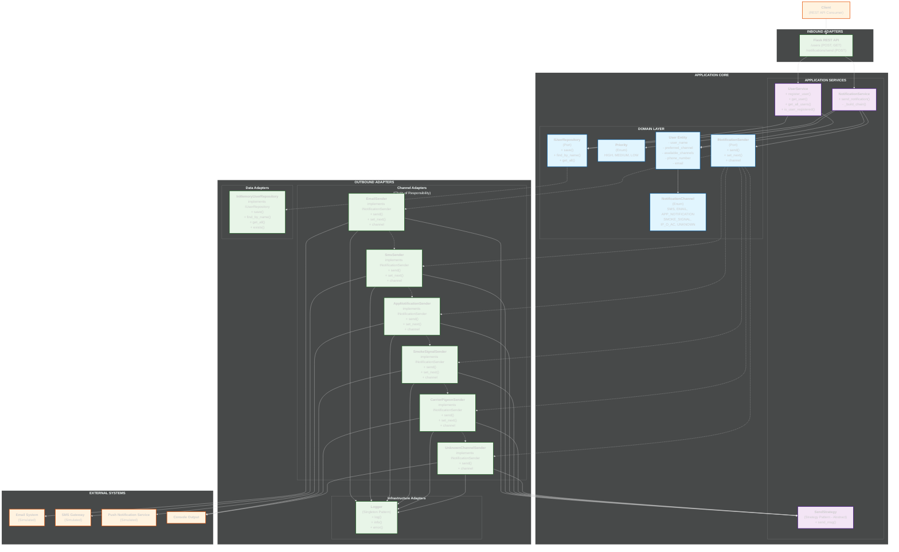

# Lab 01 - Multichannel Notification System

Author: Carlos Santiago Sandoval Casallas (csandovalc@unal.edu.co)

## System Explanation

This project implements a **Multichannel Notification System** using a REST API built with Flask. The system allows users to register with multiple communication channels (email, SMS, console) and sends notifications through their preferred channel. If the preferred channel fails, the system automatically attempts delivery through backup channels using a **Chain of Responsibility** pattern.

### Key Features:
- **User Management**: Register users with preferred and available notification channels
- **Intelligent Routing**: Attempts delivery through preferred channel first, then fallbacks
- **Failure Simulation**: Random failures are simulated to test the chain of responsibility
- **Comprehensive Logging**: All notification attempts are logged using a Singleton logger
- **Modular Architecture**: Clean separation of concerns with hexagonal architecture

### Core Components:
- **Domain Layer**: Contains business entities and rules
- **Application Layer**: Implements use cases and business logic
- **Adapters Layer**: Handles external integrations (Flask controllers, channels, repositories)

## Endpoint Documentation

### Base URL: `http://localhost:5000`
### Swagger Documentation: `http://localhost:5000/apidocs/`

| Method | Endpoint              | Description                                      |
|--------|-----------------------|--------------------------------------------------|
| POST   | `/users`              | Register a user with name, preferred and available channels |
| GET    | `/users`              | List all registered users                        |
| POST   | `/notifications/send` | Send a notification with message and priority    |

**Swagger API Documentation**: Once the application is running, visit [`http://localhost:5000/apidocs/`](http://localhost:5000/apidocs/) to explore and test the API endpoints using Swagger UI.


### Request/Response Examples:

#### POST /users
**Request:**
```json
{
  "name": "Carlos Sandoval",
  "preferred_channel": "email",
  // Supported channels: email, sms, app_notification, smoke_signal, ipoac
  "available_channels": ["email", "sms", "ipoac"],
  "phone_number": "1234567890",
  "email": "temp@mail.com"
}
```

**Response (201 Created):**
```json
{
  "message": "User registered successfully",
  "user": {
    "name": "Carlos Sandoval",
    "preferred_channel": "email",
    "available_channels": ["email", "sms", "smoke_signal"]
    "phone_number": "1234567890",
    "email": "temp@mail.com"
  }
}
```

#### GET /users
**Response (200 OK):**
```json
{
  "users": [
    {
      "name": "Carlos Sandoval",
      "preferred_channel": "email",
      "available_channels": ["email", "sms", "console"]
    }
  ]
}
```

#### POST /notifications/send
**Request:**
```json
{
  "user_name": "Carlos Sandoval",
  "message": "Your appointment is scheduled for tomorrow at 3 PM",
  "priority": "high" // can be "high", "medium", or "low"
}
```

**Response (200 OK):**
```json
{
  "message": "Notification sent successfully",
  "channel_used": "email",
  "attempts": 1,
  "delivery_status": "success"
}
```

## System Diagrams

### Class Diagram

```mermaid
---
config:
  theme: dark
---
classDiagram
    class User {
        -string _user_name
        -NotificationChannel _preferred_channel
        -List~NotificationChannel~ _available_channels
        -string _phone_number
        -string _email
        +__init__(user_name, preferred_channel, available_channels, phone_number, email)
        +user_name() string
        +preferred_channel() NotificationChannel
        +available_channels() List~NotificationChannel~
        +phone_number() string
        +email() string
        +__repr__() string
    }
    class NotificationChannel {
        <<enumeration>>
        SMS
        EMAIL
        APP_NOTIFICATION
        SMOKE_SIGNAL
        IP_O_AC
        UNKNOWN
    }
    class Priority {
        <<enumeration>>
        HIGH
        MEDIUM
        LOW
        +__init__(value)
        +value() string
    }
    class INotificationSender {
        <<interface>>
        +channel() NotificationChannel
        +send(to, message, priority) bool
        +set_next(next_handler) INotificationSender
    }
    class IUserRepository {
        <<interface>>
        +save(user) void
        +find_by_name(name) User
        +get_all() List~User~
        +exists(name) bool
    }
    class UserService {
        -IUserRepository user_repository
        +__init__(user_repository)
        +register_user(user_name, preferred_channel, available_channels, phone_number, email) User
        +get_user(user_name) User
        +get_all_users() List~User~
        +is_user_registered(user_name) bool
    }
    class NotificationService {
        -IUserRepository user_repository
        -INotificationSender notification_sender
        +__init__(user_repository, notification_sender)
        +send_notification(user_name, message, priority) dict
        -_build_chain(available_channels) INotificationSender
    }
    class SendStrategy {
        <<abstract>>
        +send_msg(user, message, channel, priority) bool
    }
    class SmsSender {
        -SendStrategy strategy
        -UserService user_service
        -INotificationSender next
        +__init__(strategy, user_service)
        +channel() NotificationChannel
        +send(to, message, priority) bool
        +set_next(next_handler) INotificationSender
    }
    class EmailSender {
        -SendStrategy strategy
        -UserService user_service
        -INotificationSender next
        +__init__(strategy, user_service)
        +channel() NotificationChannel
        +send(to, message, priority) bool
        +set_next(next_handler) INotificationSender
    }
    class AppNotificationSender {
        -SendStrategy strategy
        -UserService user_service
        -INotificationSender next
        +__init__(strategy, user_service)
        +channel() NotificationChannel
        +send(to, message, priority) bool
        +set_next(next_handler) INotificationSender
    }
    class SmokeSignalSender {
        -SendStrategy strategy
        -UserService user_service
        -INotificationSender next
        +__init__(strategy, user_service)
        +channel() NotificationChannel
        +send(to, message, priority) bool
        +set_next(next_handler) INotificationSender
    }
    class CarrierPigeonSender {
        -SendStrategy strategy
        -UserService user_service
        -INotificationSender next
        +__init__(strategy, user_service)
        +channel() NotificationChannel
        +send(to, message, priority) bool
        +set_next(next_handler) INotificationSender
    }
    class UnknownChannelSender {
        -SendStrategy strategy
        -UserService user_service
        +__init__(strategy, user_service)
        +channel() NotificationChannel
        +send(to, message, priority) bool
    }
    class InMemoryUserRepository {
        -dict users
        +__init__()
        +save(user) void
        +find_by_name(name) User
        +get_all() List~User~
        +exists(name) bool
    }
    class Logger {
        <<singleton>>
        -Logger _instance
        -bool _initialized
        +get_instance() Logger
        +log(level, message) void
        +info(message) void
        +error(message) void
        +warning(message) void
    }
    class FlaskController {
        -UserService user_service
        -NotificationService notification_service
        +__init__(user_service, notification_service)
        +register_user() Response
        +get_users() Response
        +send_notification() Response
    }
    User --> NotificationChannel : uses
    User --> Priority : uses
    UserService --> IUserRepository : depends on
    UserService --> User : creates
    NotificationService --> IUserRepository : depends on
    NotificationService --> INotificationSender : depends on
    NotificationService --> User : uses
    NotificationService --> Priority : uses
    SmsSender --|> INotificationSender : implements
    EmailSender --|> INotificationSender : implements
    AppNotificationSender --|> INotificationSender : implements
    SmokeSignalSender --|> INotificationSender : implements
    CarrierPigeonSender --|> INotificationSender : implements
    UnknownChannelSender --|> INotificationSender : implements
    SmsSender --> SendStrategy : uses
    EmailSender --> SendStrategy : uses
    AppNotificationSender --> SendStrategy : uses
    SmokeSignalSender --> SendStrategy : uses
    CarrierPigeonSender --> SendStrategy : uses
    UnknownChannelSender --> SendStrategy : uses
    InMemoryUserRepository --|> IUserRepository : implements
    FlaskController --> UserService : uses
    FlaskController --> NotificationService : uses
    SmsSender --> Logger : uses
    EmailSender --> Logger : uses
    AppNotificationSender --> Logger : uses
    SmokeSignalSender --> Logger : uses
    CarrierPigeonSender --> Logger : uses
    UnknownChannelSender --> Logger : uses
    SmsSender --> SmsSender : next
    EmailSender --> EmailSender : next
    AppNotificationSender --> AppNotificationSender : next
    SmokeSignalSender --> SmokeSignalSender : next
    CarrierPigeonSender --> CarrierPigeonSender : next
```



### Hexagonal Architecture Diagram



## Design Pattern Justification

### 1. **Chain of Responsibility Pattern**
**Location**: [`application/services/chain.py`](application/services/chain.py)

**Purpose**: Manages the sequence of notification channel attempts when the preferred channel fails.

**Implementation**:
- `NotificationHandler` abstract base class defines the chain interface
- `EmailHandler`, `SMSHandler`, `ConsoleHandler` implement specific channel logic
- Each handler attempts delivery and passes to the next handler if it fails

**Benefits**:
- Decouples senders from receivers
- Allows dynamic chain modification
- Promotes single responsibility principle

### 2. **Strategy Pattern**
**Location**: [`application/services/strategy.py`](application/services/strategy.py)

**Purpose**: Encapsulates different notification channel algorithms, allowing runtime selection.

**Implementation**:
- `ChannelStrategy` interface defines the strategy contract
- Concrete strategies for each channel type (Email, SMS, Console)
- Context class selects appropriate strategy based on channel type

**Benefits**:
- Makes algorithms interchangeable
- Eliminates conditional statements
- Easy to add new channel types

### 3. **Singleton Pattern**
**Location**: [`adapters/outbound/logger.py`](adapters/outbound/logger.py)

**Purpose**: Ensures only one logger instance exists throughout the application lifecycle.

**Implementation**:
- Thread-safe singleton implementation
- Global access point for logging functionality
- Maintains consistent logging format across the system

**Benefits**:
- Controlled access to shared resource
- Reduces memory footprint
- Centralized logging configuration

### 4. **Repository Pattern**
**Location**: [`adapters/outbound/in_memory_user_repo.py`](adapters/outbound/in_memory_user_repo.py)

**Purpose**: Abstracts data access logic and provides a uniform interface for data operations.

**Implementation**:
- `UserRepository` interface defines data access contract
- `InMemoryUserRepository` provides in-memory implementation
- Easy to swap for database implementation later

**Benefits**:
- Separation of concerns
- Testability
- Technology independence

## Set up the Project

### Prerequisites
- Docker and Docker Compose installed
- Curl for testing

### 1. Clone the Repository

```bash
git clone https://github.com/SwEng2-2025i/MJ7h.git
cd MJ7h/laboratories/laboratory_1/1000790737
```

### 2. Build and Run the Docker Container

```bash
docker-compose up --build
```

## Test the Project

### Using cURL

#### 1. Register user 1:
```bash
curl --request POST \
  --url http://127.0.0.1:5000/users \
  --header 'content-type: application/json' \
  --data '{
  "user_name": "usuario1",
  "preferred_channel": "ipoac",
  "available_channels": [
    "email",
    "sms",
    "app_notification"
  ],
  "phone_number": "12345678",
  "email": "temp@mail.com"
}'
```

#### 2. Register user 2:
```bash
curl --request POST \
  --url http://127.0.0.1:5000/users \
  --header 'content-type: application/json' \
  --data '{
  "user_name": "usuario2",
  "preferred_channel": "smoke_signal",
  "available_channels": [
    "sms",
    "app_notification",
    "smoke_signal",
    "ipoac"
  ],
  "phone_number": "12345678"
}'
```

#### 3. List all users:
```bash
curl --request GET \
  --url http://127.0.0.1:5000/users
```

#### 4. Send a notification to a user 1:
```bash
curl --request POST \
  --url http://127.0.0.1:5000/notifications/send \
  --header 'content-type: application/json' \
  --data '{
  "user_name": "usuario1",
  "message": "Hola Mundo!",
  "priority": "low"
}'
```

#### 5. Send a notification to a user 2:
```bash
curl --request POST \
  --url http://127.0.0.1:5000/notifications/send \
  --header 'content-type: application/json' \
  --data '{
  "user_name": "usuario2",
  "message": "Hola Mundo!",
  "priority": "medium"
}'
```

### Expected Behavior

When sending a notification:
1. System attempts delivery through user's preferred channel
2. If it fails (randomly simulated), tries the next available channel
3. Continues until successful delivery or all channels exhausted
4. Logs each attempt with timestamp and result
5. Returns success response with channel used and attempt count

### Testing Chain of Responsibility

Run multiple notifications to the same user to observe different channels being used due to random failures:

#### User 1 Example

```bash
# Run this multiple times to see different outcomes
for i in {1..5}; do
  curl --request POST \
  --url http://127.0.0.1:5000/notifications/send \
  --header 'content-type: application/json' \
  --data '{
  "user_name": "usuario1",
  "message": "Hola Mundo!",
  "priority": "low"
}'
  echo ""
done
```

#### User 2 Example

```bash
# Run this multiple times to see different outcomes
for i in {1..5}; do
  curl --request POST \
  --url http://127.0.0.1:5000/notifications/send \
  --header 'content-type: application/json' \
  --data '{
  "user_name": "usuario2",
  "message": "Un mensaje cualquiera",
  "priority": "high"
}'
  echo ""
done
```

The system will demonstrate the chain of responsibility by attempting different channels when the preferred one fails.
