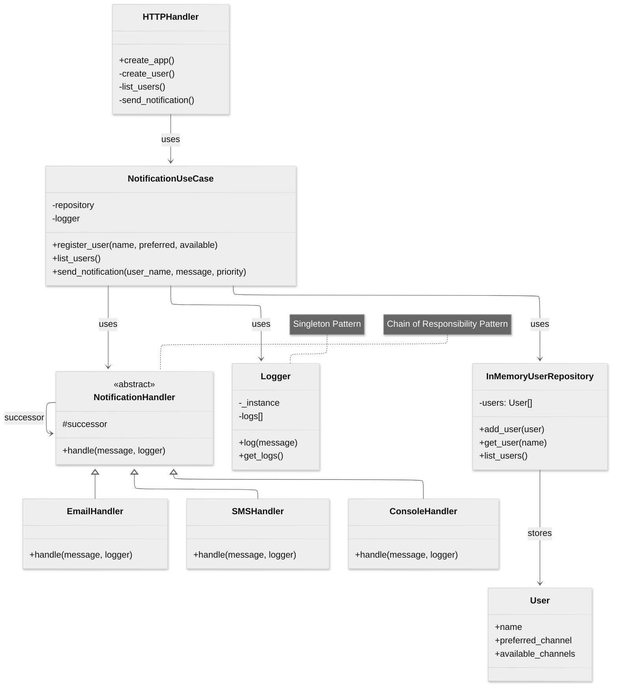

**Autor:** Daniel Felipe Soracipa Torres

# Sistema de Notificaciones Multicanal (API REST)

## Explicación del sistema

Este proyecto implementa una API REST modular para un sistema de notificaciones donde los usuarios pueden registrarse con múltiples canales de comunicación (correo electrónico, SMS, consola). El sistema implementa una estrategia de reintentos inteligente: cuando se envía una notificación, primero intenta usar el canal preferido del usuario, y si este falla, automáticamente intenta con los canales alternativos disponibles hasta lograr una entrega exitosa.

La arquitectura sigue principios de clean architecture, separando adaptadores (manejadores HTTP), lógica de aplicación (casos de uso), lógica de dominio (entidades, canales de notificación, logger) e infraestructura (repositorio en memoria). Todos los datos se almacenan en memoria; no se requiere base de datos externa.

## Documentación de Endpoints

### Registrar un usuario
- **POST /users**
- **Descripción:** Registra un usuario con nombre, canal preferido y canales disponibles.
- **Ejemplo de cuerpo de solicitud:**
```json
{
  "name": "Juan",
  "preferred_channel": "email",
  "available_channels": ["email", "sms"]
}
```
- **Respuestas:**
  - 201 Created: `{ "message": "User registered successfully" }`
  - 400 Bad Request: `{ "error": Canal no válido. Solo se permiten: email, sms, console" }`

### Listar todos los usuarios
- **GET /users**
- **Descripción:** Lista todos los usuarios registrados.
- **Ejemplo de respuesta:**
```json
[
  {
    "name": "Juan",
    "preferred_channel": "email",
    "available_channels": ["email", "sms"]
  }
]
```

### Enviar notificación
- **POST /notifications/send**
- **Descripción:** Envía una notificación a un usuario utilizando una estrategia de reintentos automáticos.
- **Funcionamiento:** 
  1. Intenta primero el canal preferido del usuario
  2. Si falla, intenta automáticamente los siguientes canales disponibles
  3. Solo devuelve fallo si ningún canal logra entregar la notificación
- **Ejemplo de cuerpo de solicitud:**
```json
{
  "user_name": "Juan",
  "message": "Tu cita es mañana.",
  "priority": "high"
}
```
- **Ejemplos de respuesta:**
  - Éxito usando canal preferido: 
    ```json
    { 
      "status": "delivered", 
      "via": "Email" 
    }
    ```
  - Éxito usando canal alternativo (después de fallo en preferido):
    ```json
    { 
      "status": "delivered", 
      "via": "SMS" 
    }
    ```
  - Fallo en todos los canales: 
    ```json
    { 
      "status": "failed" 
    }
    ```
  - Usuario no encontrado: 
    ```json
    { 
      "status": "failed", 
      "reason": "User not found" 
    }
    ```
---


## Diagrama de Clases/Módulos




---


## Patrones de Diseño Aplicados

### Chain of Responsibility

Este patrón se utiliza para implementar la lógica de reintentos de envío de notificaciones. Cada canal (Email, SMS, Console) actúa como un eslabón en una cadena de responsabilidad.

**Ejemplo de funcionamiento:**
```
Usuario Juan:
- Canal preferido: Email
- Canales disponibles: [Email, SMS, Console]

Escenario 1 - Éxito en primer intento:
1. Email →  Éxito
   Resultado: { "status": "delivered", "via": "Email" }

Escenario 2 - Reintento exitoso:
1. Email →  Fallo
2. SMS  →  Éxito
   Resultado: { "status": "delivered", "via": "SMS" }

Escenario 3 - Fallo total:
1. Email    →  Fallo
2. SMS      →  Fallo
3. Console  →  Fallo
   Resultado: { "status": "failed" }
```

**Ventajas del patrón:**
- Desacoplamiento: Cada canal opera independientemente
- Flexibilidad: Fácil agregar nuevos canales
- Manejo de fallos: Reintentos automáticos y transparentes para el cliente

### Singleton (Logger)

El logger se implementa como Singleton para asegura que todos los componentes del sistema compartan la misma instancia del logger y evita tener múltiples instancias que podrían fragmentar el historial de logs (intentos de notificaion en un mismo lugar),util porque necesitamos rastrear toda la cadena de intentos de notificación de manera centralizada y cronológica, independientemente de qué parte del sistema esté generando los logs.

**Ejemplo de uso:**
```python
# Ejemplo de uso en diferentes partes del sistema
logger1 = Logger()
logger2 = Logger()

logger1.log("Intento envío por email")
logger2.log("Email falló, intentando SMS")

print(logger1.get_logs())  # Muestra ambos mensajes
print(logger2.get_logs())  # Muestra los mismos mensajes
```

**Ventajas del patrón:**
- Consistencia: Todos los componentes escriben en el mismo log
- Centralización: Un solo punto de acceso a los logs
- Ahorro de recursos: Una sola instancia compartida

## Documentación Swagger

La API está documentada usando Swagger/OpenAPI. Puedes acceder a la documentación interactiva (si tienes flasgger o flask-swagger-ui instalado) accediendo a:

```
http://127.0.0.1:5000/apidocs/
```

Desde ahí puedes probar los endpoints y ver los esquemas de entrada y salida.

## Instrucciones de instalación y pruebas

### Prerrequisitos
- Python 3.10+
- Flask
- (Opcional para Swagger): flasgger

### Instalación
1. Instala las dependencias:
   ```bash
   pip install Flask flasgger
   ```
2. Ejecuta la aplicación:
   ```bash
   python app.py
   ```

### Ejemplos de uso (curl)

#### Registrar un usuario
```bash
curl -X POST http://127.0.0.1:5000/users \
  -H "Content-Type: application/json" \
  -d '{"name": "Juan", "preferred_channel": "email", "available_channels": ["email", "sms"]}'
```

#### Listar usuarios
```bash
curl http://127.0.0.1:5000/users
```

#### Enviar notificación
```bash
curl -X POST http://127.0.0.1:5000/notifications/send \
  -H "Content-Type: application/json" \
  -d '{"user_name": "Juan", "message": "Tu cita es mañana.", "priority": "high"}'
```

### Pruebas con Postman
1. Importa los endpoints anteriores en Postman.
2. Usa los ejemplos de payload para probar el registro, listado y envío de notificaciones.


