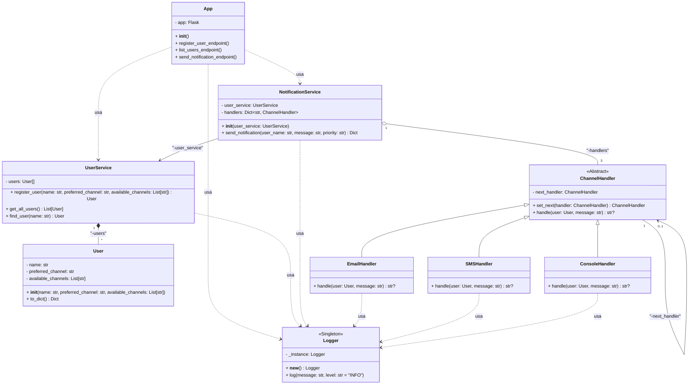

# Laboratorio 1: Sistema de Notificación Multicanal REST API

**Nombre**: Duván Felipe Mondragón Bravo

## 📋 Explicación del Sistema
Este sistema implementa una API REST para enviar notificaciones a través de múltiples canales (email, SMS, consola) usando el patrón Chain of Responsibility. Los usuarios se registran con un canal preferido y canales disponibles alternativos. Al enviar una notificación:

1. Se intenta primero el canal preferido
2. Si falla (50% probabilidad simulada), se intentan otros canales disponibles
3. Se registra cada intento mediante un Logger Singleton
4. Se retorna el resultado con el canal usado o error si todos fallan

### Características Clave
- Registro de usuarios con validación de canales
- Envío inteligente con fallback automático
- Documentación Swagger integrada
- Almacenamiento en memoria de usuarios
- Logging centralizado

## 🌐 Endpoints

### Registrar usuario
```http
POST /users
```
**Body**:
```json
{
  "name": "Juan",
  "preferred_channel": "email",
  "available_channels": ["email", "sms"]
}
```
**Respuesta exitosa (201)**:
```json
{
  "name": "Juan",
  "preferred_channel": "email",
  "available_channels": ["email", "sms"]
}
```

### Listar usuarios registrados
```http
GET /users
```
**Respuesta exitosa (200)**:
```json
[
  {
    "name": "Juan",
    "preferred_channel": "email",
    "available_channels": ["email", "sms"]
  }
]
```

### Enviar notificación
```http
POST /notifications/send
```
**Body**:
```json
{
  "user_name": "Juan",
  "message": "Su cita es mañana",
  "priority": "high"
}
```
**Respuesta exitosa (200)**:
```json
{
  "status": "success",
  "message": "Notification delivered",
  "channel": "email",
  "user": "Juan"
}
```

## 📊 Diagrama de Clases


## 🧠 Patrones de Diseño

### 1. Chain of Responsibility
- **Problema resuelto**: Manejar múltiples canales de notificación con fallback automático
- **Implementación**: 
  - `ChannelHandler` como clase base abstracta
  - Handlers concretos para cada canal (Email, SMS, Consola)
  - Encadenamiento dinámico de handlers
- **Beneficio**: Permite añadir nuevos canales sin modificar el código existente

### 2. Singleton
- **Problema resuelto**: Acceso consistente al Logger desde múltiples componentes
- **Implementación**: 
  - `Logger` con método `__new__` modificado
  - Garantiza una única instancia global
- **Beneficio**: Registro centralizado de eventos en todo el sistema

### 3. Service Layer
- **Problema resuelto**: Separar lógica de negocio de la capa web
- **Implementación**:
  - `UserService`: Maneja registro y búsqueda de usuarios
  - `NotificationService`: Orquesta el envío de notificaciones
- **Beneficio**: Mejor testabilidad y mantenibilidad del código

## ⚙️ Configuración y Pruebas

### Requisitos
- Python 3.8+
- Pip (gestor de paquetes)

### Instalación
```bash
# Clonar repositorio
git clone https://github.com/SwEng2-2025i/MJ7h/tree/main/laboratories/laboratory_1/1003635091
cd 1003635091

# Crear entorno virtual
python -m venv venv

# Activar entorno
# Linux/Mac:
source venv/bin/activate
# Windows:
.\venv\Scripts\activate

# Instalar dependencias
pip install -r requirements.txt
```

### Ejecución
```bash
python src/app.py
```

### Pruebas con curl

#### 1. Registrar usuario
```bash
curl -X POST http://localhost:5001/users \
  -H "Content-Type: application/json" \
  -d '{
    "name": "Ana",
    "preferred_channel": "sms",
    "available_channels": ["sms", "console"]
  }'
```

#### 2. Listar usuarios
```bash
curl http://localhost:5001/users
```

#### 3. Enviar notificación
```bash
curl -X POST http://localhost:5001/notifications/send \
  -H "Content-Type: application/json" \
  -d '{
    "user_name": "Ana",
    "message": "Prueba de notificación",
    "priority": "medium"
  }'
```

### Documentación Swagger
Acceder a la interfaz interactiva:  
[http://localhost:5001/apidocs/](http://localhost:5001/apidocs/)

## 📦 Dependencias
```txt
Flask==2.3.2
flasgger==0.9.7.1
Werkzeug==2.3.4
```
