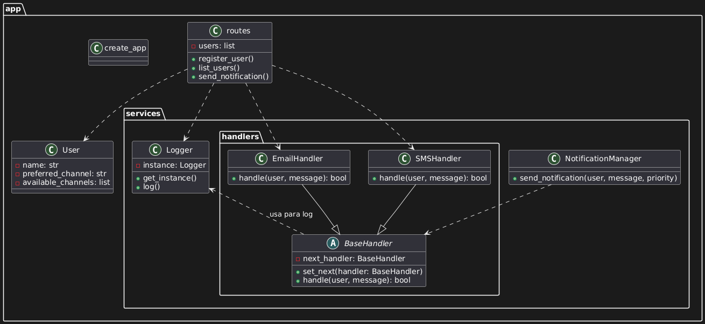

ññ# 🧪 Laboratorio Individual Avanzado: Sistema de Notificaciones Multicanal (REST API)

## 📝 Contexto

En la arquitectura de software actual, construir sistemas modulares y escalables es esencial. Los patrones de diseño juegan un papel clave para ayudar a los desarrolladores a escribir código más limpio, mantenible y extensible.

En este laboratorio individual, implementarás una API REST para un sistema de notificaciones donde los usuarios pueden registrarse con múltiples canales de comunicación (por ejemplo, email, SMS, consola). Al enviar una notificación, el sistema debe intentar primero entregarla por el canal preferido del usuario. Si la entrega falla (simulado aleatoriamente), el sistema debe intentar con los canales de respaldo usando una cadena de responsabilidad.

El laboratorio requiere el uso de al menos dos patrones de diseño (cadena de responsabilidad y uno adicional a tu elección). Simularás la lógica de notificación, modelarás el comportamiento del sistema y estructurarás la solución en componentes limpios y reutilizables.

---

## 🎯 Objetivo

Desarrollar una API REST modular para gestionar usuarios y enviar notificaciones utilizando **al menos dos patrones de diseño avanzados**, además de patrones detallados.

---

## 🔁 Lógica de Notificación

Simularás los intentos de entrega mediante una **Cadena de Responsabilidad**. Por ejemplo:

1. Un usuario tiene canal preferido = `email`, disponibles = `[email, sms]`
2. Se intenta el canal email (fallo simulado aleatoriamente)
3. Si falla, se intenta el siguiente canal (sms)

Utiliza `random.choice([True, False])` para simular los fallos.

---

## 🔧 Endpoints de la API REST

| Método | Endpoint                | Descripción                                              |
|--------|-------------------------|----------------------------------------------------------|
| POST   | `/users`                | Registrar un usuario con nombre, canal preferido y canales disponibles |
| GET    | `/users`                | Listar todos los usuarios                                |
| POST   | `/notifications/send`   | Enviar una notificación con mensaje y prioridad           |

### Ejemplos de Payload

**POST /users**
```json
{
  "name": "Juan",
  "preferred_channel": "email",
  "available_channels": ["email", "sms"]
}
```

**POST /notifications/send**
```json
{
  "user_name": "Juan",
  "message": "Tu cita es mañana.",
  "priority": "high"
}
```


---

## ✅ Requisitos

- Usar Flask para la API REST
- Aplicar al menos dos patrones de diseño
- Simular fallos en los canales y reintentar usando canales alternativos
- El logger debe registrar cada intento de notificación (Singleton opcional)
- No se requiere base de datos (se permiten estructuras de datos en memoria)
- El código debe ser modular, limpio y bien documentado

---

## 📄 Entregable

laboratories/laboratory_1/1003864575/
├── app/
│   ├── __init__.py      
│   ├── models.py         
│   ├── routes.py         
│   ├── services/
│   │   ├── logger.py      
│   │   ├── notification_manager.py  
│   │   ├── handlers/
│   │   │   ├── base_handler.py    
│   │   │   ├── email_handler.py     
│   │   │   ├── sms_handler.py       
├── tests/                
│   ├── test_app.py        
├── run.py               
├── README.md              
└── requirements.txt       

---


## Formato de Entrega
Debe entregarse **mediante un pull request a la rama principal del repositorio**, el cual debe estar fusionado antes de la fecha de entrega. En la carpeta laboratories/laboratory_1, crea una carpeta X (donde X = tu número de documento de identidad), la cual debe incluir el entregable.

## ⏱️ Fecha de entrega -> 30 de mayo de 2025 -> 23:59 GTM-5*

---

## 🚀 Instrucciones para Ejecutar el Proyecto

1. Instala las dependencias (recomendado en un entorno virtual):
   ```powershell
   pip install -r requirements.txt
   ```
2. Ejecuta la aplicación Flask:
   ```powershell
   python run.py
   ```
   La API estará disponible en http://localhost:5000

---

## 🧪 Cómo Ejecutar las Pruebas

1. Asegúrate de tener instaladas las dependencias de desarrollo (incluyendo pytest).
2. Desde la raíz del proyecto (donde está run.py), ejecuta:
   ```powershell
   pytest
   ```
   Esto buscará y ejecutará automáticamente todos los tests en la carpeta `tests/`.

---

## 🧩 Patrones de Diseño Utilizados

### 1. Chain of Responsibility (Cadena de Responsabilidad)
Este patrón se implementa en el sistema de notificaciones para gestionar el envío de mensajes a través de múltiples canales (por ejemplo, email y SMS). Cuando se intenta enviar una notificación, el sistema primero utiliza el canal preferido del usuario. Si este canal falla (simulado aleatoriamente), la responsabilidad pasa al siguiente canal disponible, y así sucesivamente, hasta que la notificación sea enviada exitosamente o se agoten los canales. Esto permite desacoplar el proceso de envío y facilita la extensión a nuevos canales en el futuro.

**Ventajas en la app:**
- Permite agregar o modificar canales de notificación sin afectar el resto del sistema.
- Hace el flujo de envío flexible y fácil de mantener.

### 2. Singleton (Logger)
El patrón Singleton se utiliza en el componente de logging (registro de eventos). El logger se implementa como una clase que asegura que solo exista una única instancia a lo largo de toda la aplicación. Esto es útil para centralizar el registro de intentos de notificación, errores y eventos importantes, evitando duplicidad y garantizando un punto único de acceso al log.

**Ventajas en la app:**
- Garantiza que todos los módulos de la aplicación utilicen el mismo logger.
- Facilita la gestión y el análisis de los registros generados durante la ejecución.

---

## 🗂️ Diagrama de Clases y Módulos

A continuación se muestra el diagrama de clases y módulos principales del sistema, el cual ilustra la relación entre los componentes clave de la aplicación:



**Explicación:**
- El diagrama representa la estructura modular del sistema de notificaciones multicanal.
- Se observa la entidad `User`, los módulos de rutas y servicios, y la jerarquía de handlers para los canales de notificación.
- El patrón Chain of Responsibility se refleja en la relación entre los handlers de notificación (por ejemplo, `EmailHandler` y `SMSHandler`), permitiendo el encadenamiento de intentos de envío.
- El logger implementa el patrón Singleton y es utilizado por los distintos componentes para centralizar el registro de eventos.
- La modularidad facilita la extensión y el mantenimiento del sistema.

---

