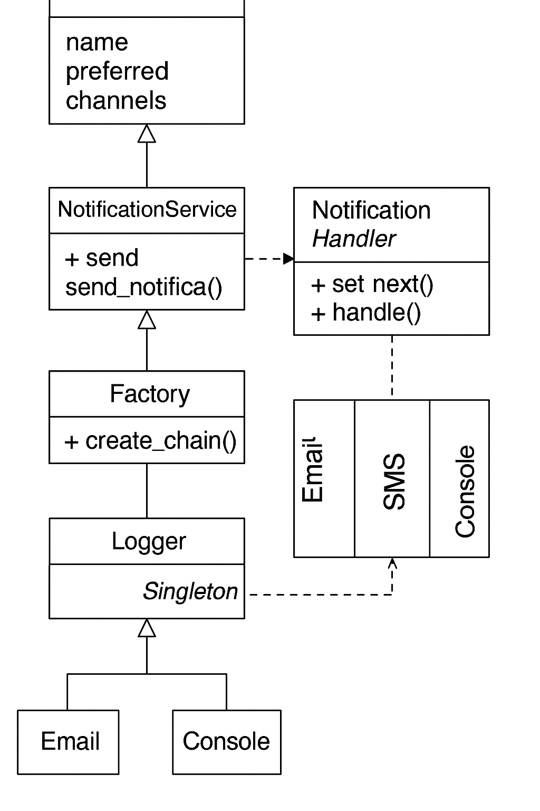

# 📬 Multichannel Notification System (API REST)- Laboratorio 1

**Nombre completo:** Sergio Alejandro Nova Pérez  
**Número de documento:** 1006739326  

---

## 📝 Descripción general

Este proyecto implementa una API REST modular en Flask para simular el envío de notificaciones multicanal (correo, SMS, consola). El sistema permite registrar usuarios con múltiples canales disponibles y seleccionar uno como preferido. Si el envío por el canal preferido falla (simulado con aleatoriedad), el sistema recurre a canales alternativos mediante el patrón **Chain of Responsibility**.

---

## 🧱 Estructura del proyecto

1006739326/
├── app/
│ ├── main.py
│ ├── models/
│ ├── patterns/
│ │ ├── channel_handler.py
│ │ └── factory.py
│ ├── routes/
│ │ └── endpoints.py
│ └── services/
│ └── logger.py
├── requirements.txt
├── swagger.yaml
├── README.md


---

## 🧠 Patrones de diseño aplicados

- 🔗 **Chain of Responsibility:** Encadena múltiples canales de notificación (email → sms → consola). Si uno falla, pasa al siguiente.
- 🏭 **Factory Pattern:** Construye dinámicamente la cadena de canales con base en la configuración del usuario.
- ♻️ **Singleton:** Logger único que registra cada intento de envío sin duplicación de estado.

---

## 🚀 Endpoints de la API

### 📌 POST `/users`
Registra un nuevo usuario con canales disponibles.

#### 📤 Request Body:
```json
{
  "name": "Juan",
  "preferred_channel": "email",
  "available_channels": ["email", "sms", "console"]
}
```
Respuesta:
```json
{
  "message": "User registered successfully",
  "user": {
    "name": "Juan",
    "preferred_channel": "email",
    "available_channels": ["email", "sms", "console"]
  }
}
```
---
### 📌 GET /users
Devuelve todos los usuarios registrados.
Respuesta:
```json
[
  {
    "name": "Juan",
    "preferred_channel": "email",
    "available_channels": ["email", "sms", "console"]
  }
]

```
---
### 📌 POST /notifications/send

Envía una notificación a un usuario. Si el canal preferido falla, se recurre a los canales alternativos.

📤 Request Body:
```json
{
  "user_name": "Juan",
  "message": "Tu cita es mañana.",
  "priority": "high"
}
```
 Respuesta si tiene éxito:
```json
 {
  "message": "Notification delivered"
}
```

 Si todos los canales fallan:
```json
{
  "error": "All channels failed"
}
```
---
### 🛠️ Instrucciones de ejecución

Requisitos:

Python 3.12

Flask

Pasos:
```
# Crear entorno virtual (opcional pero recomendado)
python -m venv venv
venv\Scripts\activate  # Windows

# Instalar dependencias
pip install -r requirements.txt

# Ejecutar la API
python -m app.main

```
---
### Pruebas con curl

Registrar usuario:
```
curl -X POST http://127.0.0.1:5000/users ^
-H "Content-Type: application/json" ^
-d "{\"name\": \"Juan\", \"preferred_channel\": \"email\", \"available_channels\": [\"email\", \"sms\"]}"
```
Enviar notificación:
```
curl -X POST http://127.0.0.1:5000/notifications/send ^
-H "Content-Type: application/json" ^
-d "{\"user_name\": \"Juan\", \"message\": \"Tu cita es mañana.\", \"priority\": \"high\"}"
```
---
### Documentación Swagger

El archivo swagger.yaml documenta los endpoints de la API y puede ser visualizado desde https://editor.swagger.io.


---
### Diagrama de clases
 
#### El diagrama del sistema incluye:

- User

- NotificationHandler (abstracto)

- EmailHandler, SMSHandler, ConsoleHandler

- Factory para crear la cadena

- Logger como Singleton
