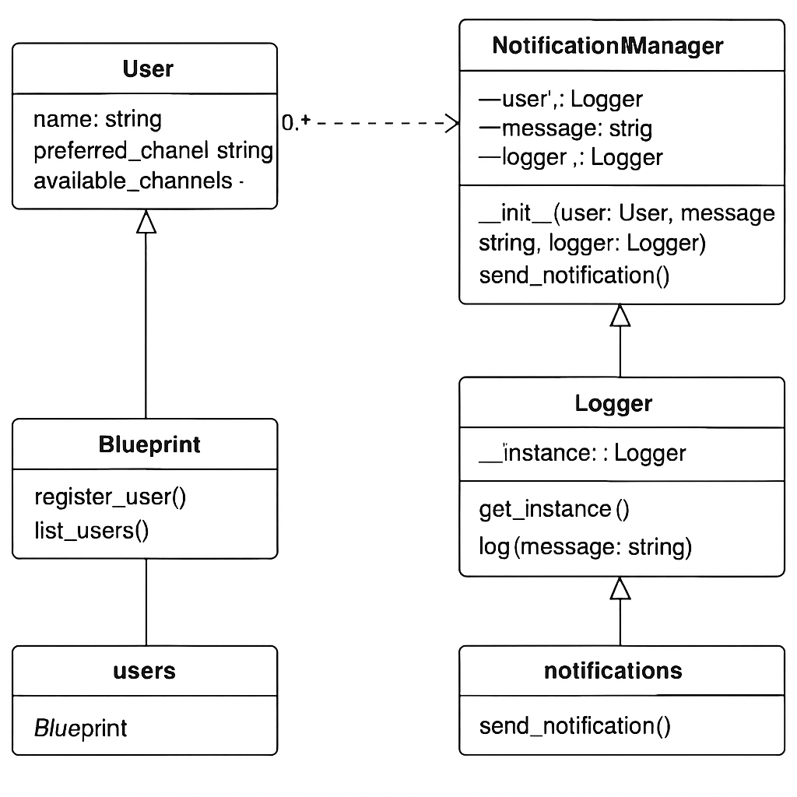

# Name: Javier Esteban Martinez Giron

# Design Patterns Justification

Design Patterns Implemented:
1. Chain of Responsibility:
   - This pattern is utilized in the `NotificationManager` class. It sequentially attempts to send notifications through a list of channels (preferred and fallback) until one succeeds or all fail.
   - This approach ensures modularity, making it easy to add or modify notification channels without impacting other parts of the system.

2. Singleton:
   - The `Logger` class employs the Singleton pattern to maintain a single instance across the application.
   - This guarantees centralized logging and avoids duplicate instances, ensuring thread safety and consistency in log management.

# Diagram of Notification System




# Application Setup and Testing Instructions

Setup Instructions:
1. Clone the repository to your local machine.
2. Install Python 3.8 or higher if not already installed.
3. Create a virtual environment and activate it:
   ```bash
   python -m venv venv
   source venv/bin/activate  # On Windows, use venv\Scripts\activate
   ```
4. Install the required dependencies:
   ```bash
   pip install -r requirements.txt
   ```
5. Ensure the directory `static` exists in the project root for the Swagger JSON.
6. Run the application:
   ```bash
   python run.py
   ```
7. Access Swagger UI at `http://localhost:5000/swagger` to explore the API documentation.

Testing Instructions:
1. Use Postman or `curl` to interact with the API endpoints:
   - **Register a User**:
     ```bash
     curl -X POST http://localhost:5000/users \
     -H "Content-Type: application/json" \
     -d '{"name": "John Doe", "preferred_channel": "email", "available_channels": ["email", "sms"]}'
     ```
   - **List Users**:
     ```bash
     curl -X GET http://localhost:5000/users
     ```
   - **Send Notification**:
     ```bash
     curl -X POST http://localhost:5000/notifications/send \
     -H "Content-Type: application/json" \
     -d '{"user_name": "John Doe", "message": "Your package has been shipped."}'
     ```
2. Observe logs for notification attempts and outcomes.
3. Verify the fallback logic by repeating tests and observing channel switching in logs.