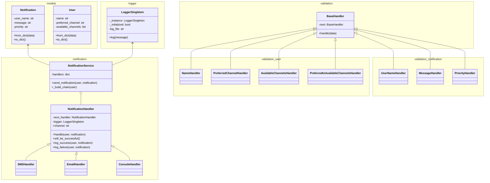

# Laboratory 1 – Multichannel Notification System  
**Author:** Samuel Josué Vargas Castro

## 🧩 Overview

This system provides an API for sending notifications to registered users through their preferred communication channels. It supports multiple notification methods and applies key software design patterns to ensure scalability, readability, and modularity.

The system exposes three main endpoints:

- `POST /users`: Creates a user with `name`, `preferred_channel`, and `available_channels`.
- `GET /users`: Retrieves all registered users.
- `POST /notifications/send`: Sends a notification to a specific user with the fields `user_name`, `message`, and `priority`.

User data is stored in an in-memory runtime database. Input validation and notification delivery are managed through handler chains that enforce format rules and simulate message delivery reliability.

---

## ⚙️ System Architecture

1. The system is built with **Flask** and uses **Flasgger** to document the API.
2. Incoming requests are validated using **handler chains** before storing or processing data.
3. When sending a notification, the system:
   - Locates the target user.
   - Builds a **chain of notification handlers**, starting with the user's preferred channel.
   - Tries to send the notification through each available channel.
   - Logs every attempt (success or failure) via a singleton logger.
   - Returns a success message if the notification is sent; otherwise, throws an error if all attempts fail.

---

## 📊 Class and Module Diagram



---

## 🏗️ Design Patterns Used

### 🏭 Factory Method
Used in the `from_dict` method of model classes (e.g., `User`, `Notification`). This encapsulates object creation and simplifies parsing from incoming JSON data.

### 🔗 Chain of Responsibility
Applied in two main areas:
- **Data validation**: A sequence of handlers ensures input data complies with expected formats. Each handler is responsible for one validation step.
- **Notification dispatching**: Handlers represent channels (e.g., SMS, console). If one fails, the next takes over until the message is successfully delivered or all channels are exhausted.

### 🔒 Singleton
Used to implement a global `LoggerSingleton` for consistent logging of all notification attempts, ensuring centralized tracking across the application.

---

## 🚀 Setup and Usage

### 📦 Installation

1. Clone the repository:
   ```bash
   git clone https://github.com/SwEng2-2025i/MJ7h.git
   cd laboratories/laboratory_1/1011201389/
   ```

2. Install the dependencies:
   ```bash
   pip install -r requirements.txt
   ```
   Or, manually:
   ```bash
   pip install flask flasgger
   ```

3. Run the Flask server:
   ```bash
   python app.py
   ```

> The API will run locally at:  
**http://127.0.0.1:5001**

---

### 📮 API Endpoints

#### 🔸 Create a User

- **POST** `/users`
- **Body Example**:
  ```json
  {
    "name": "Samuel",
    "preferred_channel": "sms",
    "available_channels": ["sms", "console"]
  }
  ```
- **Curl Command**:
  ```bash
  curl -X POST http://127.0.0.1:5001/users \
       -H "Content-Type: application/json" \
       -d '{"name": "Samuel", "preferred_channel": "sms", "available_channels": ["sms", "console"]}'
  ```

#### 🔹 Get All Users

- **GET** `/users`
- **Curl Command**:
  ```bash
  curl http://127.0.0.1:5001/users
  ```

#### 🔸 Send a Notification

- **POST** `/notifications/send`
- **Body Example**:
  ```json
  {
    "user_name": "Samuel",
    "message": "Hello, this is a test!",
    "priority": "high"
  }
  ```
- **Curl Command**:
  ```bash
  curl -X POST http://127.0.0.1:5001/notifications/send \
       -H "Content-Type: application/json" \
       -d '{"user_name": "Samuel", "message": "Hello, this is a test!", "priority": "high"}'
  ```

---

### 📘 API Documentation

Once the server is running, you can access the interactive API documentation via Swagger UI at:

👉 **http://127.0.0.1:5001/apidocs/**
