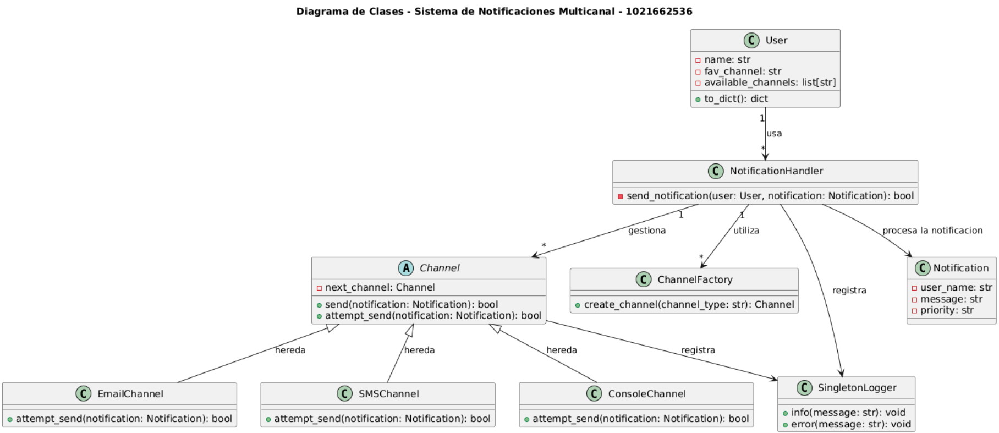

# Sistema de Notificaciones Multicanal

**Nombre :** Gabriela Gallegos Rubio

## 🎯 **Objetivo del Laboratorio**

Desarrollar una API REST modular para gestionar usuarios y enviar notificaciones utilizando **al menos dos patrones de diseño avanzados**.

## 📌 **Descripción del sistema**

Este proyecto implementa una API REST para un sistema de notificaciones multicanal, desarrollado en Python con Flask y Flask-RESTx. Permite registrar usuarios con un canal de notificación preferido (email, SMS, o consola) y enviar notificaciones a través de estos canales. Si un canal falla (simulado aleatoriamente), el sistema intenta con el siguiente canal disponible utilizando el patrón **Chain of Responsibility**. La creación de canales se gestiona mediante el patrón **Factory**, las subclases que heredan de channels alteran el tipo de objeto de acuerdo al medio de comunicación, y todos los eventos se registran en un archivo `notifications.log` usando el patrón **Singleton**, que permite mantener únicas las instancias. La API está documentada con **Swagger**, accesible en `http://localhost:5000`, proporcionando una interfaz interactiva para probar los endpoints.


## 📌 **Patrones de diseño**

- **Chain of Responsibility:** Patrón de comportamiento, fue implementado en la clase `Channel` para manejar los intentos de envío de notificaciones. Cada canal (email, SMS, consola) actúa como un elemento en la cadena, pasando la responsabilidad al siguiente canal si el actual falla puesto que se cuenta con la referencia del siguiente.


- **Factory Pattern:** Es un patrón de creación y está implementado en la clase `ChannelFactory` para crear instancias de canales de manera dinámica según el tipo de canal (email, sms, console), desacoplando la creación de objetos del resto del sistema a través de sobrescribir el método por cada canal.


- **Singleton:** Patrón de creación, fue implementado en la clase `SingletonLogger` para garantizar un único logger que registra todos los eventos de la aplicación en un archivo notifications.log.  Se escogió por lo que ofrece una solución para garantizar que una clase tenga una única instancia.


## 📌 **Estructura del proyecto**
El proyecto está organizado en paquetes Python para mantener la modularidad, con archivos `__init__.py` en cada carpeta para habilitar importaciones relativas. La estructura es la siguiente:
```
laboratories/laboratory_1/1021662536/
│
├── src/
│   ├── __init__.py
│   ├── main.py
│   ├── models/
│   │   ├── __init__.py
│   │   ├── user.py
│   │   ├── notification.py
│   ├── channels/
│   │   ├── __init__.py
│   │   ├── base_channel.py
│   │   ├── email.py
│   │   ├── sms.py
│   │   ├── console.py
│   │   ├── factory.py
│   ├── handlers/
│   │   ├── __init__.py
│   │   ├── notification_handler.py
│   ├── logger/
│   │   ├── __init__.py
│   │   ├── logger.py
│
├── .gitignore
├── README.md
├── requirements.txt
├── swagger.yml
```

## 📌 **Diagrama de clases**



## 📌 **Endpoints**

La API expone los siguientes endpoints, documentados con Swagger en http://localhost:5000:

### **POST /api/users   - Registro de un Usuario nuevo**

- Descripción: Registra un nuevo usuario con nombre, canal preferido y canales disponibles.

```
{
  "name": "Luna",
  "fav_channel": "sms",
  "available_channels": ["email", "sms"]
}
```

-**Respuesta exitosa (201)**
```
Response body
{
  "message": "Usuario creado",
  "user": {
    "name": "Luna",
    "favorite_channel": "sms",
    "available_channels": [
      "email",
      "sms"
    ]
  }
}
```

- **Errores:**
+ 400: Campos faltantes o canal preferido no válido.


**Ejemplo cURL:**
```
curl -X 'POST' \
  'http://localhost:5000/api : /users' \
  -H 'accept: application/json' \
  -H 'Content-Type: application/json' \
  -d '{
  "name": "Luna",
  "fav_channel": "sms",
  "available_channels": ["email", "sms"]
}'
```

### **GET /api/users - Lista de los usuarios actuales**

- Descripción: Devuelve la lista de todos los usuarios registrados.

-**Respuesta exitosa (200)**
```
{
  "users": [
    {
      "name": "Gaby",
      "favorite_channel": "email",
      "available_channels": [
        "email",
        "sms"
      ]
    },
    {
      "name": "Luna",
      "favorite_channel": "sms",
      "available_channels": [
        "email",
        "sms"
      ]
    }
  ]
}
```
**Ejemplo cURL:**
```
curl -X 'GET' \
  'http://localhost:5000/api : /users' \
  -H 'accept: application/json'
```


### **POST /api/notifications/send - Envío de Notificación**

- Descripción: Envía una notificación a un usuario con un mensaje y prioridad.
```
{
  "user_name": "Gaby",
  "message": "Recuerda que el próximo domingo tienes un vuelo",
  "priority": "Media"
}
```

-**Respuesta exitosa (200)**
```
{
  "message": "Notificación enviada"
}
```
**Errores:**

- 404: Usuario no encontrado.
- 400: Fallo al enviar la notificación o campos faltantes.


**Ejemplo cURL:**
```
curl -X 'POST' \
  'http://localhost:5000/api : /notifications/send' \
  -H 'accept: application/json' \
  -H 'Content-Type: application/json' \
  -d '{
  "user_name": "Gaby",
  "message": "Recuerda que el próximo domingo tienes un vuelo",
  "priority": "Media"
}'
```

## 📌 **Configuración**
Se deben segir estos pasos para configurar y ejecutar el proyecto localmente:

1. Clona el repositorio:
```
git clone <URL_DEL_REPOSITORIO>
cd laboratories/laboratory_1/1021662536
```

2. Crea un entorno virtual:
```
python -m venv venv
```

3. Instala las dependencias:
```
pip install -r requirements.txt
```

4. Ejecuta la aplicación:
```
python -m src.main
```

- Accede a la documentación Swagger: Visita  la URL parecida a http://localhost:5000 que saldrá después de ejecutar la aplicación para explorar la interfaz interactiva de Swagger, aquí podrás realizar la prueba de endpoints.


## 📌 **Documentación Swagger**

La documentación está en http://localhost:5000 con Flask-RESTx, ofreciendo:

- Interfaz interactiva: Pruebas de endpoints.
- Esquemas detallados: Payloads y respuestas (200, 201, 400, 404).
- Validación: Verifica esquemas.El archivo swagger.yml contiene la definición YAML, exportada desde /swagger.json.

