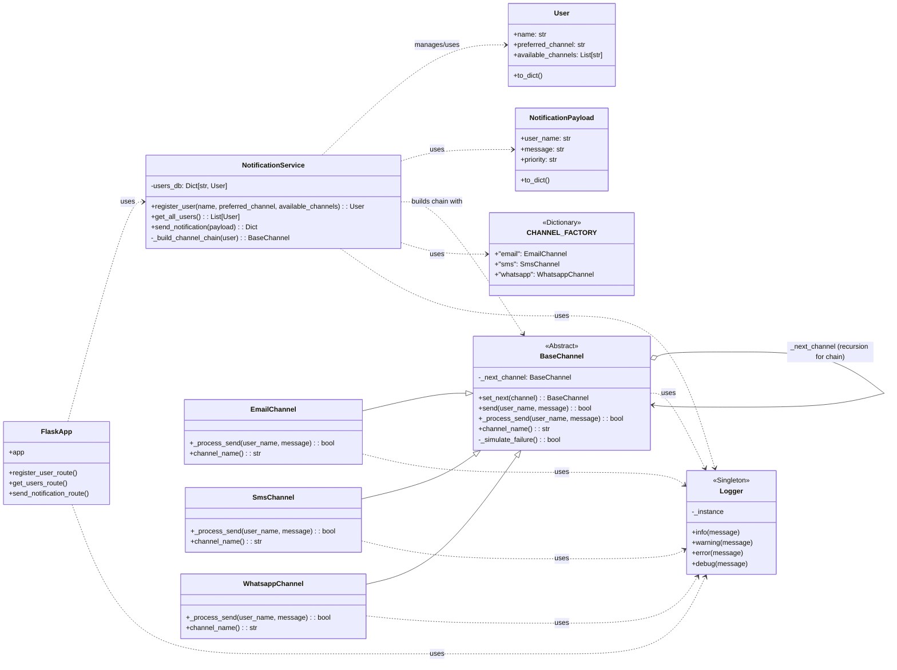

# Sistema de Notificación Multicanal (API REST)

Este laboratorio implementa un sistema de notificación multicanal utilizando Flask y patrones de diseño como Cadena de Responsabilidad y Singleton.

## Desarrollado y presentado por: 

**Nombre :** Santiago Restrepo Rojas
**Documento de Identidad:** 1021665025

## Explicación del Sistema

El presente sistema de notificación multicanal ha sido desarrollado como una API REST utilizando Flask. Permite a los usuarios registrarse especificando un nombre, un canal de comunicación preferido (entre 'email', 'sms', 'whatsapp') y una lista de canales disponibles para ellos.

**Funcionamiento Principal:**
1.  **Registro de Usuarios (`POST /users`):** Los usuarios se almacenan en una estructura de datos en memoria. Se valida que el nombre, el canal preferido y los canales disponibles sean proporcionados, y que los canales especificados sean válidos dentro del sistema. El canal preferido debe estar incluido en la lista de canales disponibles del usuario.
2.  **Listado de Usuarios (`GET /users`):** Devuelve una lista de todos los usuarios registrados con sus configuraciones.
3.  **Envío de Notificaciones (`POST /notifications/send`):** Para enviar una notificación, se debe proporcionar el `user_name` del destinatario, el `message` y una `priority` (aunque la prioridad no afecta la lógica de envío actual, se incluye según los requisitos).

**Lógica de Notificación y Patrones de Diseño:**

*   **Cadena de Responsabilidad:** Cuando se envía una notificación, el sistema primero intenta utilizar el canal preferido del usuario.
    *   Se construye dinámicamente una cadena de manejadores de canales para el usuario específico. El primer manejador es el canal preferido, seguido por los otros canales disponibles en el orden en que fueron listados (excluyendo duplicados).
    *   Cada canal en la cadena intenta "enviar" la notificación. El envío es simulado y puede fallar aleatoriamente.
    *   Si un canal falla, la responsabilidad de enviar la notificación pasa al siguiente canal en la cadena.
    *   Esto continúa hasta que un canal envía la notificación con éxito o hasta que todos los canales en la cadena han fallado.
    *   Los canales implementados son `EmailChannel`, `SmsChannel`, y `WhatsappChannel`, todos heredando de una clase base abstracta `BaseChannel` que define la interfaz común y la lógica de encadenamiento. Una `CHANNEL_FACTORY` facilita la creación de instancias de estos canales.

*   **Singleton:** Se utiliza para el `Logger` de la aplicación.
    *   Esto asegura que exista una única instancia del logger (`app.utils.logger.logger`) a lo largo de toda la aplicación.
    *   Todos los eventos importantes, como intentos de notificación, resultados de envío (éxito/fallo por canal), registro de usuarios y errores, son registrados a través de esta única instancia.
    *   Los logs se emiten tanto a la consola como a un archivo `app.log` en el directorio raíz del proyecto, facilitando el seguimiento y la depuración.

**Estructura del Proyecto:**
El código está organizado en un paquete `app` que contiene:
-   `main.py`: Punto de entrada de la aplicación Flask, define los endpoints y la configuración de Swagger.
-   `models/`: Contiene las clases `User` y `NotificationPayload` que representan las entidades de datos.
-   `channels/`: Incluye la `BaseChannel` y las implementaciones concretas (`EmailChannel`, `SmsChannel`, `WhatsappChannel`), además de una factoría de canales.
-   `services/`: Contiene `NotificationService`, que encapsula la lógica de negocio para la gestión de usuarios y el proceso de envío de notificaciones, incluyendo la construcción de la cadena de responsabilidad.
-   `utils/`: Incluye la implementación del `Logger` Singleton.

Los datos de los usuarios se mantienen en memoria (un diccionario en `NotificationService`) y no se utiliza una base de datos externa. La documentación de la API se genera automáticamente con Flasgger y está disponible en la ruta `/apidocs`.

## Documentación de Endpoints (Swagger)

La documentación de la API está disponible en `/apidocs` cuando la aplicación está en ejecución.

## Diagrama de Clases/Módulos

A continuación, se presenta un diagrama simplificado de las principales clases y sus relaciones:


**Leyenda del Diagrama:**
- `ClaseA --|> ClaseB`: `ClaseA` hereda de `ClaseB`.
- `ClaseA ..> ClaseB : uses`: `ClaseA` depende de (usa) `ClaseB`.
- `ClaseA o--> ClaseB`: `ClaseA` tiene una composición/agregación de `ClaseB` (en este caso, `_next_channel`).
- `<<Abstract>>`: Indica una clase abstracta.
- `<<Singleton>>`: Indica el patrón Singleton.
- `<<Dictionary>>`: Representa el factory de canales que es un diccionario.

**Descripción de Componentes Clave:**
-   **`FlaskApp` (`main.py`):** Gestiona las rutas de la API REST, recibe las solicitudes HTTP, las delega al `NotificationService` y devuelve las respuestas. Utiliza `Flasgger` para la documentación Swagger.
-   **`NotificationService`:** Orquesta la lógica de negocio. Mantiene un registro en memoria de `User`s (`users_db`). Construye la cadena de `BaseChannel`s para un usuario y la invoca para enviar notificaciones. Utiliza `Logger`.
-   **`User`:** Modelo de datos para un usuario, con su nombre, canal preferido y canales disponibles.
-   **`NotificationPayload`:** Modelo de datos para el cuerpo de la solicitud de notificación.
-   **`BaseChannel`:** Clase abstracta base para todos los canales de notificación. Implementa el esqueleto del patrón Cadena de Responsabilidad (`set_next`, `send`).
    -   **`EmailChannel`, `SmsChannel`, `WhatsappChannel`:** Implementaciones concretas de `BaseChannel`. Cada una define su lógica `_process_send` (simulada) y su `channel_name`.
-   **`CHANNEL_FACTORY`:** Un diccionario que mapea nombres de canales a sus clases constructoras, facilitando la creación dinámica de instancias de canales.
-   **`Logger`:** Implementación Singleton para el registro centralizado de eventos en la aplicación.

Este diagrama muestra las interacciones principales. `NotificationService` es central, utilizando los modelos de datos y construyendo la cadena de canales. Todos los componentes principales utilizan el `Logger`.

## Justificación de Patrones de Diseño

### 1. Cadena de Responsabilidad (Chain of Responsibility)
- **Propósito:** Permite pasar solicitudes a lo largo de una cadena de manejadores. Al recibir una solicitud, cada manejador decide si procesa la solicitud o la pasa al siguiente manejador en la cadena.
- **Aplicación:** Se utiliza para gestionar el envío de notificaciones a través de múltiples canales. Si el canal preferido de un usuario falla, la solicitud de notificación se pasa al siguiente canal disponible en su lista, y así sucesivamente, hasta que la notificación se envíe con éxito o se agoten los canales.

### 2. Singleton
- **Propósito:** Asegura que una clase tenga solo una instancia y proporciona un punto de acceso global a ella.
- **Aplicación:** Se utiliza para el sistema de logging. Es crucial tener una única instancia del logger para centralizar todos los registros de eventos (intentos de notificación, fallos, éxitos). Esto evita la creación múltiple de manejadores de archivos o flujos de salida y asegura la consistencia en los formatos de log.


## Instrucciones de Configuración y Pruebas

### Prerrequisitos
- Python 3.8+
- pip (Python package installer)

### Configuración
1. Clona el repositorio.
2. Navega a la carpeta del proyecto: `cd laboratories/laboratory_1/1021665025`
3. Instala las dependencias:
   ```bash
   pip install -r requirements.txt
   ```
4. Ejecuta la aplicación (asegúrate de estar en la carpeta `laboratories/laboratory_1/1021665025`):
   ```bash
   python -m app.main
   ```
La API estará disponible en `http://127.0.0.1:5000`.

### Ejemplos de Pruebas (curl)

**Registrar un usuario:**
```bash
curl -X POST http://127.0.0.1:5000/users \
-H "Content-Type: application/json" \
-d '{
  "name": "Juan",
  "preferred_channel": "email",
  "available_channels": ["email", "sms", "whatsapp"]
}'
```

**Listar todos los usuarios:**
```bash
curl -X GET http://127.0.0.1:5000/users
```

**Enviar una notificación:**
```bash
curl -X POST http://127.0.0.1:5000/notifications/send \
-H "Content-Type: application/json" \
-d '{
  "user_name": "Juan",
  "message": "Tu cita es mañana.",
  "priority": "high"
}'
```