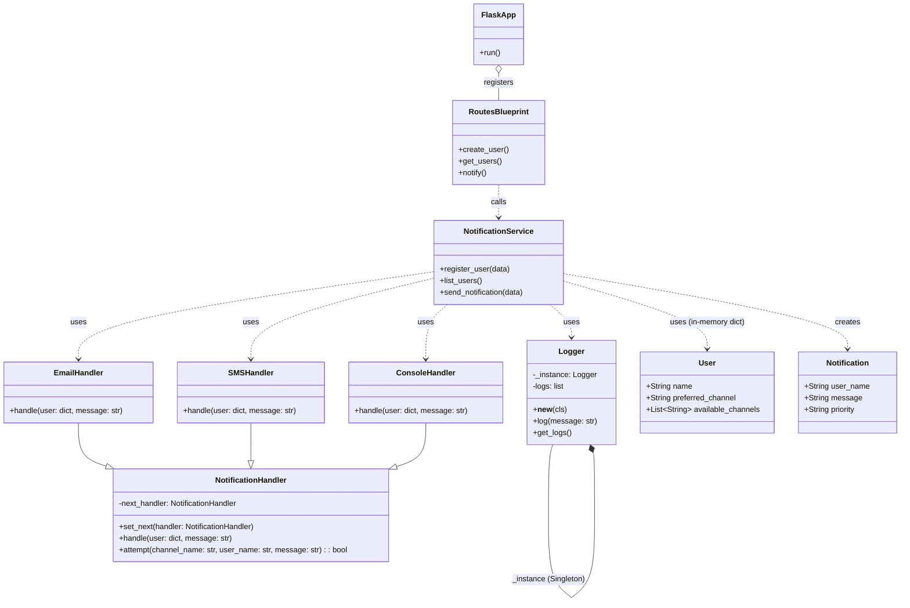

# 🧪 **Multichannel Notification System (REST API)**

**Nombre completo:** Juan Jose Medina Guerrero \
**Número de documento:** 1029980718

---

## 📝 Descripción general

Este sistema permite registrar usuarios con múltiples canales de notificación (email, SMS, consola) y enviar mensajes utilizando el canal preferido. Si el canal falla (simulado aleatoriamente), se utiliza un canal alternativo disponible mediante el patrón **Chain of Responsibility**.

Incluye documentación Swagger para explorar y probar los endpoints fácilmente desde el navegador.

---

## 🎯 Funcionalidades

- Registrar usuarios con canales de notificación preferidos y alternativos.
- Enviar notificaciones que se enrutan automáticamente a través de una cadena de canales.
- Registrar cada intento de notificación con un **logger Singleton**.
- API REST construida con Flask y documentada con Swagger.

---

## ⚙️ Endpoints REST

| Método | Ruta                  | Descripción                          |
| ------ | --------------------- | ------------------------------------ |
| POST   | `/users`              | Registrar un nuevo usuario           |
| GET    | `/users`              | Listar todos los usuarios            |
| POST   | `/notifications/send` | Enviar una notificación a un usuario |

### Ejemplos de uso (curl)

**Registrar usuario:**

```bash
curl -X POST http://127.0.0.1:5000/users -H "Content-Type: application/json" -d "{\"name\":\"Juan Perez\",\"preferred_channel\":\"email\",\"available_channels\":[\"email\",\"sms\",\"console\"]}"
```

**Enviar notificación:**

```bash
curl -X POST http://127.0.0.1:5000/notifications/send -H "Content-Type: application/json" -d "{\"user_name\":\"Juan Perez\",\"message\":\"Tu cita es mañana\", \"priority\":\"high\"}"
```

**Ver usuarios:**

```bash
curl http://127.0.0.1:5000/users
```

---

## ♻️ Patrones de diseño aplicados

1. **Chain of Responsibility:** Se utiliza para gestionar el intento de envío de notificaciones por múltiples canales. Cada `NotificationHandler` (EmailHandler, SMSHandler, ConsoleHandler) intenta procesar la solicitud. Si no puede (o el canal no está disponible/falla aleatoriamente), pasa la solicitud al siguiente handler en la cadena. Esto permite un desacoplamiento entre el emisor de la solicitud y sus receptores concretos.

2. **Singleton:** La clase `Logger` se implementa como un Singleton. Esto asegura que exista una única instancia del logger en toda la aplicación, permitiendo un punto centralizado de registro para todos los eventos de notificación y otros mensajes importantes del sistema.

---

## 📊 Diagrama de clases (UML)



---

## ▶️ Cómo ejecutar

1.  Asegúrate de tener Python 3.x instalado.
2.  Clona el repositorio (si aplica) y navega a la carpeta `laboratories/laboratory_1/1029980718`.
3.  Crea un entorno virtual (recomendado):
    ```bash
    python -m venv venv
    ```
4.  Activa el entorno virtual:
    - En Windows:
      ```bash
      .\venv\Scripts\activate
      ```
    - En macOS/Linux:
      ```bash
      source venv/bin/activate
      ```
5.  Instala las dependencias:

    ```bash
    pip install -r requirements.txt
    ```

    (El archivo `requirements.txt` contiene `flask` y `flasgger`)

6.  Ejecuta el servidor:

    ```bash
    python main.py
    ```

    La aplicación correrá en `http://127.0.0.1:5000/` por defecto.

7.  Abre tu navegador y ve a:
    ```
    http://127.0.0.1:5000/apidocs/
    ```
    Aquí podrás ver la documentación interactiva de Swagger UI y probar los endpoints.

---

## 🗂️ Estructura del proyecto

```
1029980718/
│
├── app/
│   └── __init__.py             # Inicializa la app Flask y Swagger
│
├── chanels/
│   ├── __init__.py
│   ├── base.py                 # Clase base NotificationHandler
│   ├── console.py              # Handler para notificaciones por consola
│   ├── email.py                # Handler para notificaciones por email
│   └── sms.py                  # Handler para notificaciones por SMS
│
├── logger/
│   ├── __init__.py
│   └── logger.py               # Implementación del Logger Singleton
│
├── models/
│   ├── __init__.py
│   └── notification.py         # Modelo para la entidad Notification
│
├── routes/
│   ├── __init__.py
│   └── routes.py               # Define los endpoints de la API (Flask Blueprint)
│
├── services/
│   ├── __init__.py
│   └── notification_service.py # Lógica de negocio para usuarios y notificaciones
│
├── .gitignore                  # Archivos y carpetas a ignorar por Git
├── main.py                     # Punto de entrada de la aplicación
├── requirements.txt            # Dependencias del proyecto
└── README.md                   # Este archivo
```
