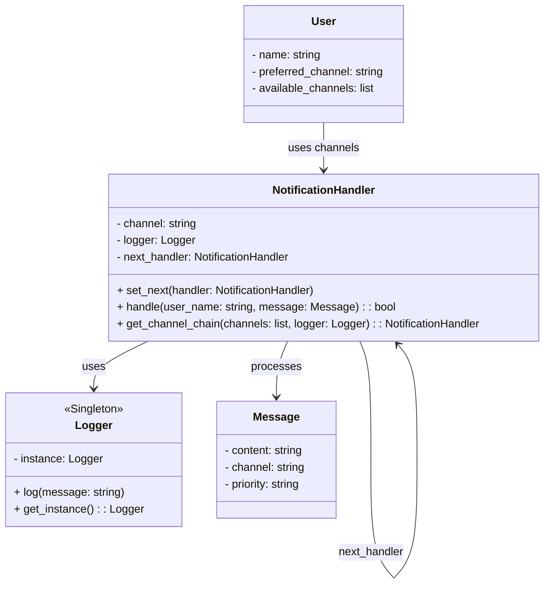

# Multichannel Notification System - RESTAPI

**Nombre completo:** Juan Esteban Cárdenas Huertas

**ID del estudiante:** 1031420925

---

## Descripción del sistema

Este sistema REST API simula el envío de notificaciones a usuarios a través de múltiples canales (email, SMS, consola, etc.). Cada usuario tiene un canal preferido, pero si este falla, el sistema intenta con los canales alternativos usando el patrón **Chain of Responsibility**.

Además, el sistema registra cada intento de notificación usando un logger implementado con el patrón **Singleton**.

---

## Estructura de carpetas

```text
app/
├── init.py
├── main.py
├── routes.py
├── models/
│ ├── init.py
│ ├── user.py
│ └── notification.py
├── services/
│ ├── init.py
│ ├── decorators.py
│ ├── channel_handler.py
│ └── logger.py
README.md
requirements.txt
```

---

## Diagrama de clases

---

## Endpoints

### `POST /users`

Registra un nuevo usuario.

| Parámetro           | Tipo    | Obligatorio | Descripción                                |
|---------------------|---------|-------------|--------------------------------------------|
| name                | string  | Sí          | Nombre del usuario                         |
| preferred_channel   | string  | Sí          | Canal preferido (`email`, `sms`, `console`)|
| available_channels  | array   | Sí          | Canales disponibles para el usuario        |

#### Ejemplo de solicitud:
```json
{
  "name": "Juan",
  "preferred_channel": "email",
  "available_channels": ["email", "sms"]
}
```

#### Respuestas posibles:

| Código HTTP | Descripción                    | Ejemplo respuesta                                      |
|-------------|--------------------------------|--------------------------------------------------------|
| 200         | Usuario registrado exitosamente| `{"message": "User Juan registered successfully."}`    |
| 400         | Datos de entrada inválidos     | `{"error": "Missing required field 'name'."}`          |
| 409         | El usuario ya existe.     | `{"error": "User Ana already exists.}"`          |

---

### `GET /users`

Lista todos los usuarios registrados.

#### Parámetros:  
Ninguno

#### Respuesta exitosa:

| Código HTTP | Descripción                  | Ejemplo respuesta                                                       |
|-------------|------------------------------|--------------------------------------------------------------------------|
| 200         | Diccionario con todos usuarios| `{"Juan": {"preferred_channel": "email", "available_channels": ["email", "sms"]}}` |

---

### `POST /notifications/send`

Envía una notificación a un usuario. Usa el canal preferido y recurre a los alternativos si falla.

| Parámetro  | Tipo    | Obligatorio | Descripción                                       |
|------------|---------|-------------|---------------------------------------------------|
| user_name  | string  | Sí          | Nombre del usuario destinatario                  |
| message    | string  | Sí          | Contenido del mensaje                            |
| priority   | string  | No          | Prioridad del mensaje (por ejemplo: `high`)      |

#### Ejemplo de solicitud:
```json
{
  "user_name": "Juan",
  "message": "Your appointment is tomorrow.",
  "priority": "high"
}
```

#### Respuestas posibles:

| Código HTTP | Descripción                            | Ejemplo respuesta                                       |
|-------------|----------------------------------------|---------------------------------------------------------|
| 200         | Notificación enviada exitosamente      | `{"result": "Notification sent via EMAIL"}`             |
| 400        | Faltan campos en la solicitud                | `{"error": "Missing user_name, message or priority"}`                           |
| 404         | Usuario no encontrado                  | `{"error": "User not found"}`                           |
| 500         | Todos los canales de notificación fallaron | `{"result": "All channels failed for user Juan"}`     |

---

## Instalación y ejecución

1. Clona el repositorio:

```text
git clone https://github.com/SwEng2-2025i/MJ7h.git
cd laboratories/laboratory_1/1031420925
```

2. Crea un entorno virtual y actívalo:

```text
python -m venv venv
source venv/bin/activate  # Linux/macOS
venv\Scripts\activate     # Windows
```

3. Instala dependencias:

```text
pip install -r app/requirements.txt
```

4. Ejecuta la app

```text
python -m app.main
```

5. Abre tu navegador y visita: http://localhost:5000/


## Swagger UI

La documentación Swagger está implementada con flasgger y se puede consultar en:

http://localhost:5000/apidocs/

Incluye todos los endpoints con sus esquemas y ejemplos.

---

## Pruebas con curl

### Registrar usuario

```curl
curl -X POST http://127.0.0.1:5000/users -H "Content-Type: application/json" -d "{\"name\": \"Ana\", \"preferred_channel\": \"email\", \"available_channels\": [\"email\", \"sms\", \"console\"]}"
```

### Listar usuarios

```curl
curl http://127.0.0.1:5000/users
```

### Enviar notificación

```curl
curl -X POST http://127.0.0.1:5000/notifications/send -H "Content-Type: application/json" -d "{\"user_name\": \"Ana\", \"message\": \"Recordatorio de reunión\", \"priority\": \"high\"}"
```

---

## Patrones de diseño utilizados

- **Chain of Responsibility**  
  Permite procesar un intento de notificación mediante una cadena de canales disponibles, probando uno por uno hasta que alguno funcione o se agoten.

- **Singleton**  
  Usado para asegurar que el objeto `Logger` sea único y accesible globalmente sin múltiples instancias.

--- 


## Justificación de los patrones de diseño

- **Chain of Responsibility:** Permite encadenar múltiples manejadores de canales, facilitando la extensión y el manejo dinámico de intentos de notificación.
- **Singleton:** Asegura que el logger sea una única instancia para manejar logs de forma consistente y evitar conflictos o múltiples archivos.

## Comentarios en el código

El código fuente cuenta con comentarios explicativos en clases, métodos y funciones clave para facilitar su mantenimiento y comprensión.
