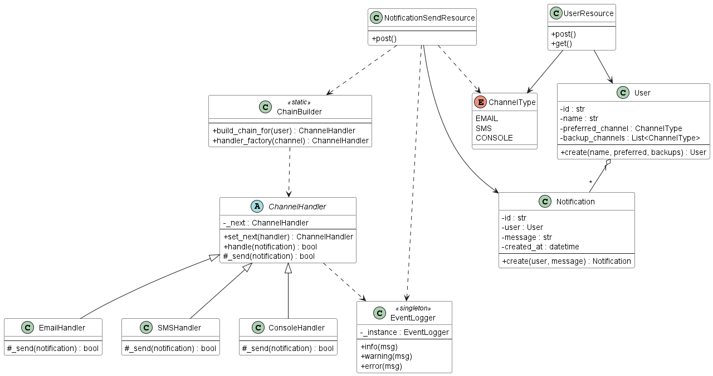

# Multichannel Notification System REST-API

> Ingeniería de Software II – Laboratorio individual  
> **Autor:** Nicolás Zuluaga Galindo

## Descripción

La Multichannel Notification System API es un servicio RESTful en Flask que permite registrar usuarios y enviarles notificaciones de forma resiliente. Cada usuario define un canal preferido y una lista de canales de respaldo; al disparar un mensaje la API prueba el preferido y, si falla, avanza por los demás hasta lograr la entrega o agotar opciones. Se simulan tres medios: Email (-20 % de fallos, p. ej. rebotes SMTP), SMS (-10 % de fallos, caída de gateway) y Console (100 % de éxito, imprime en log). Esta probabilidad se controla con random() dentro de cada handler, de modo que el flujo refleja escenarios reales de indisponibilidad.

El núcleo se apoya en tres patrones de diseño:

- **Chain of Responsibility** enlaza los ChannelHandler (Email → SMS → Console) para aplicar el fallback sin condicionar la capa REST.

- **Factory Method** (handler_factory) decide en tiempo de ejecución qué handler concreto instanciar, favoreciendo la incorporación de nuevos canales —por ejemplo, Telegram o Push— sin tocar la lógica de negocio.

- **Singleton** (EventLogger) configura un único logger que escribe cada intento (TRY) y el cierre (END) en logs/notifications.log, evitando duplicar recursos y asegurando trazabilidad uniforme.

Con esta combinación, la API resulta modular, extensible y fácil de depurar, ideal para demostrar buenas prácticas de arquitectura orientada a patrones.

## Arquitectura



## Endpoints principales

| Método | URL                   | Descripción         |
| ------ | --------------------- | ------------------- |
| POST   | `/users`              | Registrar usuario   |
| GET    | `/users`              | Listar usuarios     |
| POST   | `/notifications/send` | Enviar notificación |

## Patrones de diseño aplicados

### Chain of Responsability

Este patrón de comportamiento permite pasar solicitudes a lo largo de una cadena de manejadores. Al procesar una solicitud, el elemento decide si es trabajarla o debe transferirla al siguiente elemento. Dentro del laboratorio, se evidencia la aplicabilidad de este patrón en las notificaciones al usuario. Esto permite probar cada uno de los métodos hasta encontrar el que permite enviar el mensaje. La aplicación de Chain of Responsability, favorece el principios de responsabilidad única debido a que se le asigna la tarea a un handler a la vez; asi mismo, permite cumplir el principio de abierto/cerrado, ya que al momento de presentar una respuesta negativa, se cierra el handler y se empieza con el siguiente.

### Factory method

Factory Method proporciona una interfaz para crear objetos en una superclase, esto permite alterar el tipo de objetos que se crearan. Dentro del laboratorio, se evidencia la aplicabilidad de este patrón en la sección de chain, en donde se crea un channel handler que alimenta cada uno de los posibles handlers (EmailHandler, SMSHandler y ConsoleHandler). La implementación de Factory Method facilita la adición de nuevos métodos de notificación en un incremento futuro. Adicionalmente, se evita un acoplamiento fuerte entre el creador y los medios concretos.

### Singleton

El patrón Singleton garantiza que exista una única instancia de una clase durante todo el ciclo de vida de la aplicación y que sea accesible desde cualquier punto del código. En este laboratorio la instancia única es el EventLogger. Al iniciar el primer objeto, el logger configura el archivo logs/notifications.log y los parámetros de formato; en llamadas posteriores se reutiliza la misma instancia y la misma configuración.

## Instalación rápida

```bash
python -m venv .venv
source .venv/bin/activate        # Windows: .venv\Scripts\activate
pip install -r requirements.txt
python -m API.main               # corre en http://127.0.0.1:5000
```

## TEST - Ejemplos en POSTMAN

A continuación se presentan los ejemplos

### Users

#### GET Users


#### POST users

Body:
{
"name": "Juan",
"preferred_channel": "email",
"available_channels": ["email", "sms"]
}


#### POST Notifications

Body:
{
"user_name": "Juan",
"message": "Your appointment is tomorrow.",
"priority": "high"
}


## Acceso documentación en Swagger

Para revisar la documentación Swagger, ingresa a la URL base de la API seguida de /apidocs/, por ejemplo: http://127.0.0.1:5000/apidocs/.

## Referencias

- https://refactoring.guru/es/design-patterns/chain-of-responsibility
- https://refactoring.guru/es/design-patterns/factory-method
- https://refactoring.guru/es/design-patterns/singleton
- https://plantuml.com/es/guide
