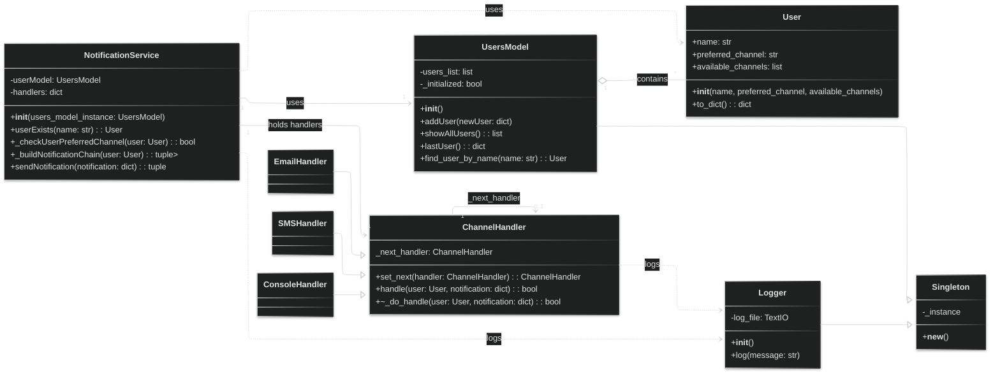

# Multichannel Notification System (REST API)

---

> **Martin Moreno Jara** \
> mamorenoj

## System Explanation

This project implements a Multichannel Notification System as a REST API using
Flask. The system allows users to register with their preferred and available
communication channels (e.g., email, SMS, console). The core functionality
revolves around sending notifications, where the system attempts delivery
through a series of channels if the primary one fails, leveraging the Chain of
Responsibility design pattern.

Key features include:

- **User Management**: Register and retrieve user profiles, specifying their
  preferred and available notification channels.
- **Multichannel Notification Delivery**: Send notifications to registered
  users. The system will first attempt delivery via the user's preferred
  channel.
- **Fallback Mechanism**: If a channel fails (simulated randomly), the system
  automatically retries delivery via the next available channel in a predefined
  order arranged by the chain of responsability.
- **Logging**: All notification attempts and their outcomes are logged to a .txt
  file and to the terminal for traceability.
- **Modularity**: The codebase is structured into distinct modules to ensure
  clear separation of concerns, reusability, and maintainability.

## Endpoint Documentation

The API exposes the following endpoints:

| Method | Path                  | Description                                   |
| :----- | :-------------------- | :-------------------------------------------- |
| `POST` | `/users`              | Register a new user with their channels       |
| `GET`  | `/users`              | Retrieve a list of all registered users       |
| `POST` | `/notifications/send` | Send a notification with message and priority |

### Example Payloads

**POST /users**

```json
{
  "name": "Juan",
  "preferred_channel": "email",
  "available_channels": ["email", "sms"]
}
```

**POST /notifications/send**

```json
{
  "user_name": "Juan",
  "message": "Your appointment is tomorrow.",
  "priority": "high"
}
```

## Class/Module diagram



### Detailed folder structure

| Folder/File                        | Classes / Functions                                 | Responsibility                                                                       |
| ---------------------------------- | --------------------------------------------------- | ------------------------------------------------------------------------------------ |
| `controllers/`                     | `notifications_controller.py`, `user_controller.py` | Implements bussiness logic                                                           |
| `patterns/`                        | `channel_handler.py`, `singleton.py`                | Templates of design patterns to be implemented                                       |
| `models`                           | `user.py`, `usersModel.py`                          | Handles user data manipulation (storage, retrieval)                                  |
| `services/notification_service.py` | `NotificationService`                               | Implements notification sending logic via chain of responsability                    |
| `routes/`                          | `users.py`, `notifications.py`                      | Separation of concern of endpoints for user and notification. Includes swagger logic |
| `utils/`                           | `handler.py`, `logger.py`                           | Application utilities                                                                |
| `main.py`                          | -                                                   | Application bootstrap and main file                                                  |

## Design Pattern Justifications

This system leverages two key design patterns to ensure modularity, flexibility,
and maintainability:

1.  **Chain of Responsibility:**

    - **Purpose**: To decouple the sender of a request from its receiver by
      giving multiple objects a chance to handle the request.
    - **Application**: In this system, the Chain of Responsibility pattern is
      used for the notification delivery process. When a notification is sent,
      it first goes to a `ChannelHandler` (e.g., `EmailHandler`). If that
      handler successfully delivers the notification, the chain terminates. If
      it fails or cannot handle the request, it passes the request to the next
      handler in the chain (e.g., `SMSHandler`, then `ConsoleHandler`). This
      allows for a flexible and extensible way to manage multiple communication
      channels and their fallback mechanisms.
    - **Benefits**:
      - **Reduced Coupling**: The `NotificationService` (sender) does not need
        to know the specific sequence of channels or their individual handling
        logic.
      - **Flexibility**: New notification channels can be added by simply
        creating a new `ChannelHandler` and inserting it into the chain without
        modifying existing handler code.
      - **Orderly Processing**: Ensures a defined sequence of attempts
        (preferred channel first, then fallbacks).

2.  **Singleton:**
    - **Purpose**: To ensure a class has only one instance, and to provide a
      global point of access to it.
    - **Application**: The `Logger` utility is implemented as a Singleton. This
      means there will always be only one instance of the `Logger` throughout
      the application's lifecycle, managing the `notification_log.txt` file.
      Besides, the `usersModel` model also implements Singleton, in order not to
      alter the in-memory list that stores the `User` objects. Otherwise, this
      list would be overwritten each time the `UsersModel` is initialized.
    - **Benefits**:
      - **Controlled Access**: Guarantees that all parts of the application
        write to the same log file instance, preventing conflicts or multiple
        log files. For the usersModel, it prevents the memory from being
        overwritten.
      - **Resource Management**: Efficiently manages the logging resource (the
        file handle), avoiding unnecessary overhead of creating multiple logger
        instances. The same goes to the usersModel instances.
      - **Global Point of Access**: Easy to access the logger and usersModel
        from anywhere in the application without passing instances around.

## Setup and Instructions

To get the Multichannel Notification System API up and running, follow these
steps:

### Prerequisites

- Python 3.8+
- `pip` (Python package installer)

### 1. Clone the Repository

If this were a public repository, you'd clone it:

```bash
git clone <repository-url>
cd laboratories\laboratory_1\1034657217
```

### 2. Create and Activate a Virtual Environment

It's highly recommended to use a virtual environment to manage dependencies.

```bash
python -m venv venv
```

```bash
.\venv\Scripts\activate
```

### 3. Install Dependencies

Install the required Python packages using pip and the requirements file:

```bash
pip install -r .\requirements.txt
```

### 4. Run the application

Go to the src/ folder and execute the main.py file to start the Flask
development server:

```bash
cd .\src\
```

```bash
python main.py
```

### 5. Access Swagger Documentation

Once the app is running, you can check out the swagger documentation in
`http://localhost:5000/swagger-ui`

### 6. Testing the API with curl

#### Register a User

```bash
curl -X POST -H "Content-Type: application/json" -d '{
  "name": "Jose",
  "preferred_channel": "email",
  "available_channels": ["email", "sms", "console"]
}' http://localhost:5000/users
```

#### List all users

```bash
curl -X GET http://localhost:5000/users
```

#### Send a notification

```bash
curl -X POST -H "Content-Type: application/json" -d '{
  "user_name": "Jose",
  "message": "Recuerda terminar laboratorio 1",
  "priority": "high"
}' http://localhost:5000/notifications/send
```

After sending a notification, check the notification_log.txt file created in the
directory to see the history of all attempted deliveries of the notification.
