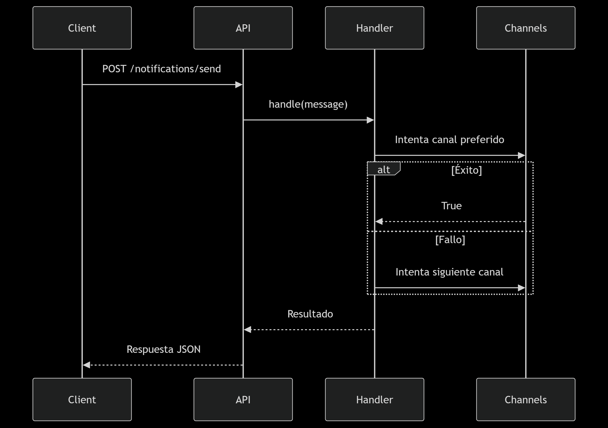

## 👨‍💻 Autor
**Edinson Sanchez Fuentes**  
✉️ edsanchezf@unal.edu.co
🔗 [Perfil de GitHub](https://github.com/Fuentesadmin2021)  
🏫 Universidad Nacional de Colombia / Ingeniería de Sistemas y Computación 

---

# 📢 Notifications API System 
<div>
  <p><em>Sistema de notificaciones multicanal con Flask y patrones de diseño</em></p>
</div>

---

## 🚀 Características principales
✅ **Registro de usuarios** con canales preferidos  
✅ **Envío inteligente** de notificaciones (email, SMS, consola)  
✅ **Chain of Responsibility** para manejar fallos  
✅ **Simulación de errores** aleatorios  
✅ **API REST** documentada  

---

## 🔧 Tecnologías utilizadas
<p align="left">
  
  
  
</p>

---

## 📦 Estructura del proyecto
```bash
notifications_api/
├── app.py # Punto de entrada
├── notification/ # Lógica de notificaciones
│ ├── init.py
│ ├── channels.py # Canales (Email, SMS, Console)
│ └── handler.py # Chain of Responsibility
├── models/ # Modelos de datos
│ ├── init.py
│ └── user.py # Clase User
├── utils/ # Utilidades
│ └── logger.py # Logger (Singleton)
├── requirements.txt # Dependencias
└── README.md # ¡Este archivo!
```
---

## 🛠️ Configuración rápida
```bash
# 1. Clonar repositorio
git clone https://github.com/Fuentesadmin2021/notifications_api.git
cd notifications_api

# 2. Crear entorno virtual (Windows)
python -m venv venv
venv\Scripts\activate

# 3. Instalar dependencias
pip install -r requirements.txt

# 4. Ejecutar la API
python app.py
```

## 🤝 Contribuir
```bash
# 1. Haz fork del proyecto
# 2. Crea tu rama de feature
git checkout -b feature/nueva-funcionalidad

# 3. Haz commit de tus cambios
git commit -m "feat: añade nueva funcionalidad"

# 4. Haz push a la rama
git push origin feature/nueva-funcionalidad

# 5. Abre un Pull Request
```
## 🌐 Endpoints de la API | Interfaz Dinámica

<div align="center">

| 🔄 Método | 📍 Endpoint                | 📝 Descripción                     |
|-----------|---------------------------|--------------------------------------|
| `POST`    | `/users`                  | Registra un nuevo usuario            | 
| `GET`     | `/users`                  | Lista todos los usuarios registrados | 
| `POST`    | `/notifications/send`     | Envía una notificación multicanal    |
</div>

---

## ✨ Ejemplos Interactivos

[](http://localhost:5000/apidocs/)


## 📊 Diagrama de flujo
<div align="center">
  
</div>

<div align="center"> <p>✨ Hecho con ❤️ para <strong>Ingeniería de Software II</strong> ✨</p>
<p><sub>© 2023 - Todos los derechos reservados</sub></p> </div> 