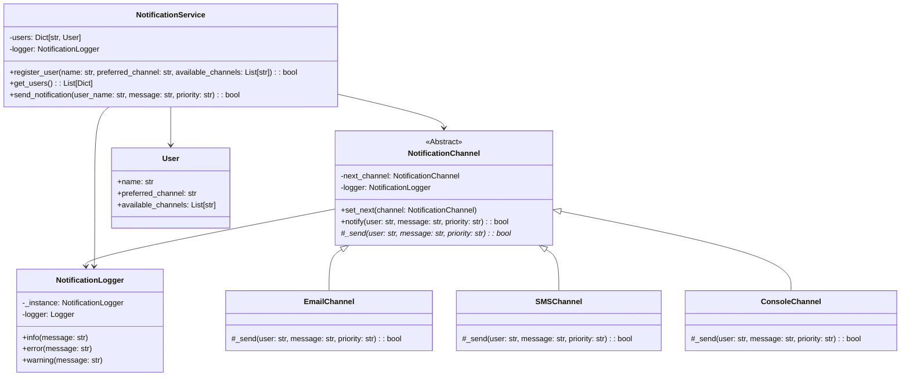

# 🚀 Multichannel Notification System

## 👤 Student Information
- **Name:** Juan David Rivera
- **ID:** 1093589207

## 📝 System Description
This is a Flask-based REST API that implements a multichannel notification system using advanced design patterns. The system allows users to register with multiple communication channels (email, SMS, console) and sends notifications through these channels with fallback mechanisms.

## 🏗️ Design Patterns Used

### 1. Chain of Responsibility Pattern
- **Where:** `channels/notification_channels.py`
- **Why:** Used to create a chain of notification channels where if one fails, it automatically tries the next one.
- **Benefits:** 
  - Decouples sender from receivers
  - Provides flexibility in choosing which channel handles the notification
  - Easy to add new channels without modifying existing code

### 2. Singleton Pattern
- **Where:** `utils/logger.py`
- **Why:** Ensures a single logging instance throughout the application
- **Benefits:**
  - Centralized logging
  - Resource efficiency
  - Consistent log format

## 🔌 API Endpoints

### 1. Register User
```http
POST /users
```
**Request Body:**
```json
{
  "name": "Juan",
  "preferred_channel": "email",
  "available_channels": ["email", "sms"]
}
```
**Response:**
```json
{
  "message": "User registered successfully"
}
```

### 2. List Users
```http
GET /users
```
**Response:**
```json
{
  "users": [
    {
      "name": "Juan",
      "preferred_channel": "email",
      "available_channels": ["email", "sms"]
    }
  ]
}
```

### 3. Send Notification
```http
POST /send
```
**Request Body:**
```json
{
  "user_name": "Juan",
  "message": "Your appointment is tomorrow.",
  "priority": "high"
}
```
**Response:**
```json
{
  "message": "Notification sent successfully"
}
```

## 🛠️ Setup Instructions

1. Clone the repository and navigate to the project directory:
```powershell
cd laboratories/laboratory_1/1093589207
```

2. Create and activate virtual environment:
```powershell
python -m venv venv
.\venv\Scripts\Activate.ps1
```

3. Install dependencies:
```powershell
pip install -r requirements.txt
```

4. Run the application:
```powershell
python app.py
```

## 🧪 Testing Instructions

### Using PowerShell

1. Register a user:
```powershell
$headers = @{
    "Content-Type" = "application/json"
}
$body = @{
    name = "Juan"
    preferred_channel = "email"
    available_channels = @("email", "sms")
} | ConvertTo-Json

Invoke-RestMethod -Uri "http://localhost:5000/users" -Method Post -Headers $headers -Body $body
```

2. List users:
```powershell
Invoke-RestMethod -Uri "http://localhost:5000/users" -Method Get
```

3. Send notification:
```powershell
$body = @{
    user_name = "Juan"
    message = "Test notification"
    priority = "high"
} | ConvertTo-Json

Invoke-RestMethod -Uri "http://localhost:5000/send" -Method Post -Headers $headers -Body $body
```

### Using Swagger UI
1. Open your browser and visit: `http://localhost:5000/apidocs/`
2. Use the interactive documentation to test endpoints

## 📚 System Features

1. **Chain of Responsibility Implementation**
   - Channels are chained in order of preference
   - If preferred channel fails, system automatically tries next available channel
   - Ensures message delivery through fallback mechanism

2. **Random Failure Simulation**
   - Email and SMS channels randomly fail to demonstrate fallback mechanism
   - Console channel always succeeds as last resort

3. **Logging System**
   - All notification attempts are logged using Singleton pattern
   - Log file: `notification_system.log`
   - Tracks successful and failed delivery attempts

## 🏗️ Project Structure
```
1093589207/
├── app.py                    # Main Flask application
├── requirements.txt          # Project dependencies
├── README.md                # Project documentation
├── channels/
│   └── notification_channels.py  # Channel implementations
├── services/
│   └── notification_service.py   # Business logic
└── utils/
    └── logger.py            # Logging singleton
```

## 📊 Class/Module Diagram



## 🔍 Testing
Run the test suite:
```powershell
python -m pytest test_notification_service.py -v
```

## 📝 Notes
- The system uses Swagger for API documentation
- All endpoints return appropriate HTTP status codes
- Error handling is implemented for invalid requests
- The Chain of Responsibility pattern allows easy addition of new notification channels
- Logging helps track system behavior and troubleshoot issues Notification System

This is a Flask-based REST API that implements a notification system with multiple communication channels using the Chain of Responsibility and Singleton design patterns.

## Design Patterns Used

1. **Chain of Responsibility Pattern**
   - Used in the notification channel implementation
   - Allows fallback to alternative channels when preferred channel fails
   - Makes it easy to add new channel types

2. **Singleton Pattern**
   - Used in the logging system
   - Ensures a single logger instance throughout the application
   - Centralizes logging configuration

## Project Structure

```
.
├── app.py              # Main Flask application
├── requirements.txt    # Project dependencies
├── channels/          
│   └── notification_channels.py  # Channel implementations
├── services/
│   └── notification_service.py   # Business logic
└── utils/
    └── logger.py      # Singleton logger
```

## API Endpoints

### Register User
- **POST** `/users`
```json
{
  "name": "Juan",
  "preferred_channel": "email",
  "available_channels": ["email", "sms"]
}
```

### List Users
- **GET** `/users`

### Send Notification
- **POST** `/send`
```json
{
  "user_name": "Juan",
  "message": "Your appointment is tomorrow.",
  "priority": "high"
}
```

## Setup and Running

1. Create a virtual environment:
```bash
python -m venv venv
source venv/bin/activate  # On Windows: venv\Scripts\activate
```

2. Install dependencies:
```bash
pip install -r requirements.txt
```

3. Run the application:
```bash
python app.py
```

## Testing

You can test the API endpoints using curl or any API testing tool like Postman.
