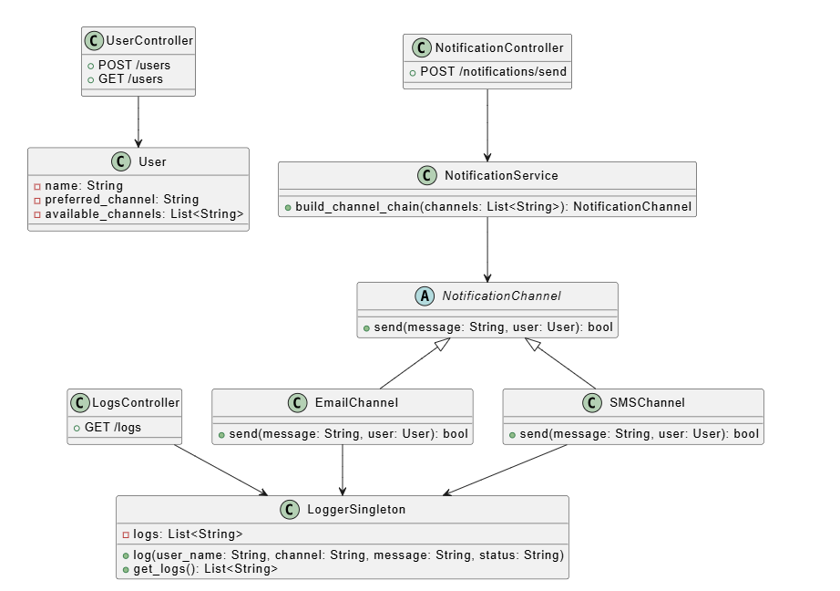
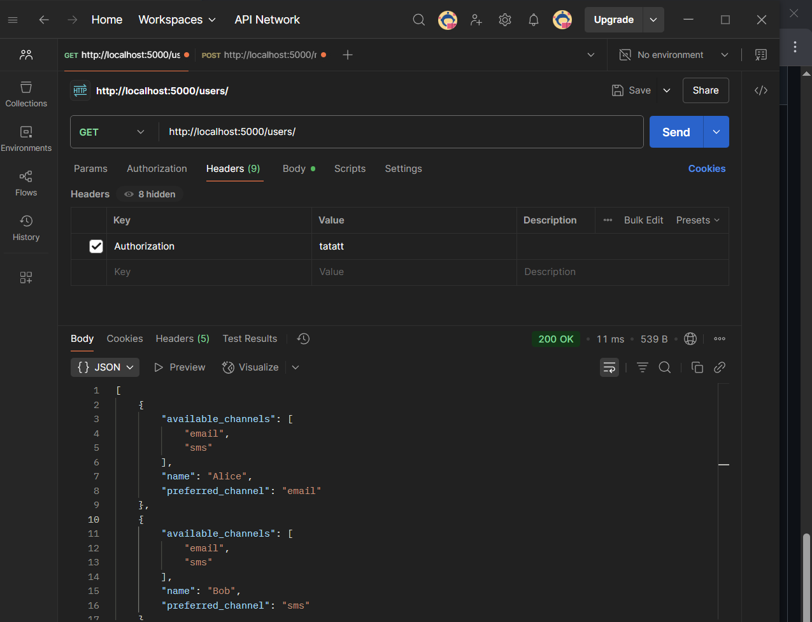
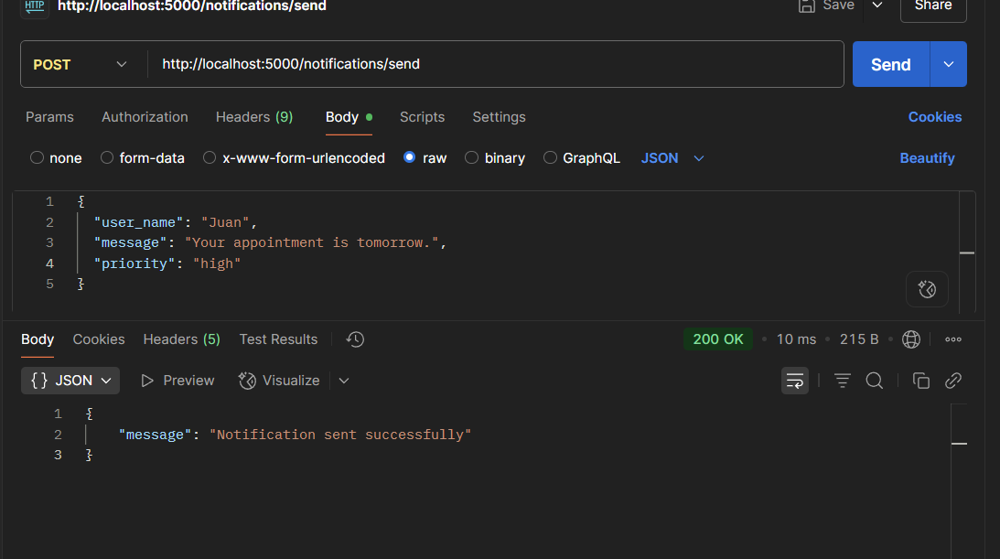
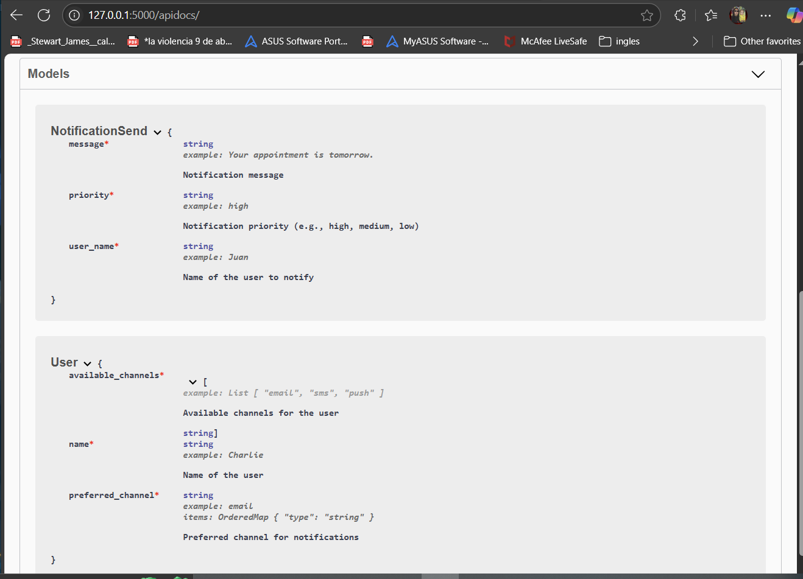

# 🧪 Advanced Individual Lab: Multichannel Notification System (REST API)
**Nombre:** Jhoan Sebastian Franco Ruiz

---

## 📝 Descripción general

Este sistema permite registrar usuarios con múltiples canales de notificación (email, SMS) y enviar mensajes utilizando el canal preferido. Si el canal falla, se utiliza un canal alternativo disponible mediante el patrón **Chain of Responsibility**.  
Incluye documentación Swagger para explorar y probar los endpoints fácilmente desde el navegador.

---

## 🎯 Funcionalidades

- Registrar usuarios con canales de notificación preferido y alternativos.
- Enviar notificaciones que se enrutan automáticamente a través de una cadena de canales.
- Registrar cada intento de notificación con un **logger Singleton**.
- API REST construida con Flask y documentada con Swagger.

---

## 📁 Estructura del Proyecto

```
app/
├── main.py
├── controllers/
│   ├── user_controller.py
│   └── notification_controller.py
├── models/
│   └── user.py
├── channels/
│   ├── base_channel.py
│   ├── email_channel.py
│   └── sms_channel.py
├── services/
│   └── notification_service.py
├── logger/
│   └── logger.py
├── imagenes/

README.md
requirements.txt
```

---

## 🔧 Endpoints REST

| Método | Endpoint                  | Descripción                                      |
|--------|---------------------------|--------------------------------------------------|
| POST   | `/users/`                 | Registrar usuario con canales                    |
| GET    | `/users/`                 | Listar usuarios                                  |
| POST   | `/notifications/send`     | Enviar notificación a usuario                    |


## 🖼️ Diagrama de Clases/Módulos



---

## Patrones de diseño aplicados

- **Chain of Responsibility:** Para intentar el envío de notificaciones por varios canales en orden.
- **Singleton:** Logger centralizado para registrar todos los intentos de notificación.


---

## Instalación y Ejecución

1. Instala las dependencias:
   ```bash
   pip install -r requirements.txt
   ```
2. Ejecuta el servidor:
   ```bash
   python app/main.py
   ```
3. Abre tu navegador en:
   ```
   http://localhost:5000/apidocs
   ```
   para explorar la API con Swagger.

---
### Ejemplo de uso (curl)

**Registrar usuario**
```bash
curl -X POST http://localhost:5000/users/ -H "Content-Type: application/json" -H "Authorization: test" -d "{\"name\": \"Juan\", \"preferred_channel\": \"email\", \"available_channels\": [\"email\", \"sms\"]}"

```

**Listar usuarios**
```bash
curl -X GET http://localhost:5000/users/ -H "Authorization: test"
```

**Enviar notificación**
```bash
curl -X POST http://localhost:5000/notifications/send -H "Content-Type: application/json" -H "Authorization: test" -d "{\"user_name\": \"Juan\", \"message\": \"Tu cita es mañana.\", \"priority\": \"high\"}"
```

---


## 🧪 Pruebas en POSTMAN
GET


POST

---

## 📑 Swagger

La documentación Swagger está disponible en:  
`http://localhost:5000/apidocs`


---
